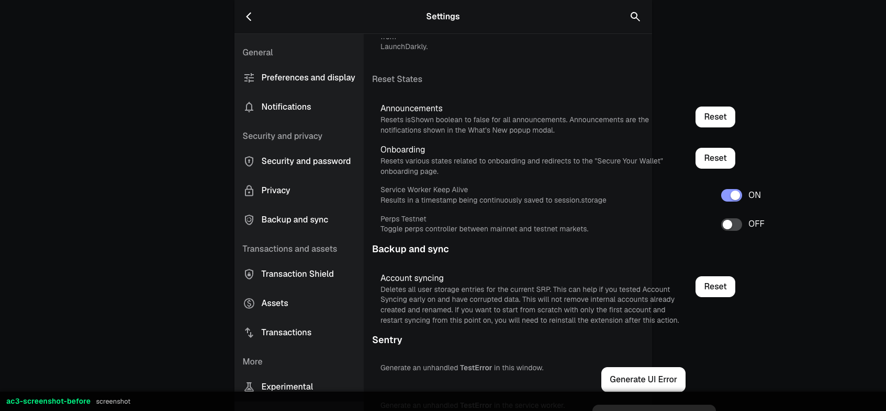
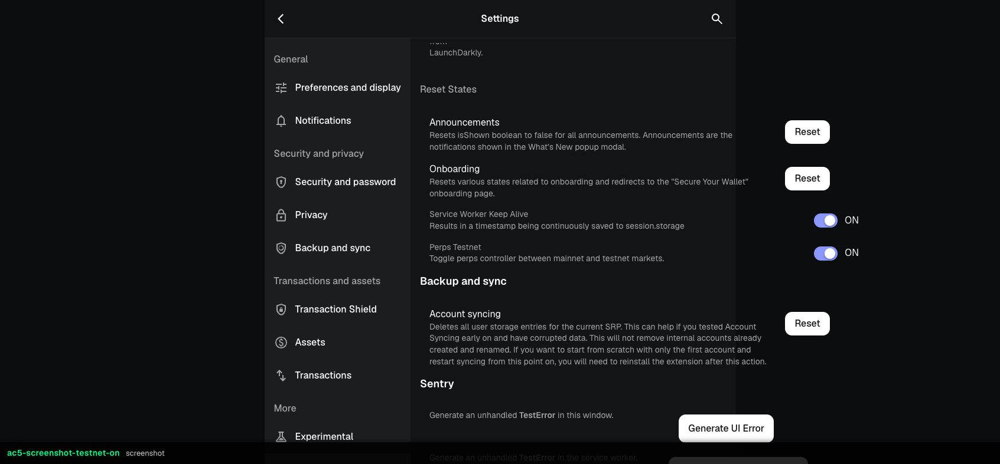

## **Description**

Adds a developer-only perps testnet toggle to the Developer Options settings tab. The `PerpsController.toggleTestnet()` RPC was registered in the background but had no UI consumer — extension users had no way to switch between mainnet and testnet perps markets. This wires up the existing RPC with an `actions.ts` wrapper and a `process.env.METAMASK_DEBUG`-gated toggle row.

## **Changelog**

CHANGELOG entry: null

## **Related issues**

Fixes: [TAT-2901](https://consensyssoftware.atlassian.net/browse/TAT-2901)

## **Manual testing steps**

1. Build with `yarn start` (METAMASK_DEBUG=true is set automatically in dev builds)
2. Open MetaMask extension → Settings → Developer Options (or navigate to `#/settings/debug`)
3. Scroll to "Reset States" section — confirm "Perps Testnet" toggle is visible
4. Click the toggle — confirm it flips to ON
5. Navigate to the Perps tab — confirm testnet markets are shown
6. Toggle back to OFF — confirm mainnet markets return

## **Screenshots/Recordings**

### **Before**

_Toggle element did not exist — `data-testid="perps-testnet-toggle"` returned null._

### **After**

Toggle visible in developer options, OFF state:

Toggle ON — `PerpsController.isTestnet` confirmed true in storage:

## **Pre-merge author checklist**

- [x] I've followed [MetaMask Contributor Docs](https://github.com/MetaMask/contributor-docs) and [MetaMask Extension Coding Standards](https://github.com/MetaMask/metamask-extension/blob/main/.github/guidelines/CODING_GUIDELINES.md).
- [x] I've completed the PR template to the best of my ability
- [x] I've included tests if applicable
- [x] I've documented my code using [JSDoc](https://jsdoc.app/) format if applicable
- [x] I've applied the right labels on the PR (see [labeling guidelines](https://github.com/MetaMask/metamask-extension/blob/main/.github/guidelines/LABELING_GUIDELINES.md)). Not required for external contributors.

## **Pre-merge reviewer checklist**

- [ ] I've manually tested the PR (e.g. pull and build branch, run the app, test code being changed).
- [ ] I confirm that this PR addresses all acceptance criteria described in the ticket it closes and includes the necessary testing evidence such as recordings and or screenshots.
