## **Description**

Two related fixes for TAT-2831:

1. **(AC1 — order entry)** The Long/Short submit button on the order entry screen was enabled when `availableBalance = 0`. `hasNoAvailableBalance` was computed and used for button text but was not included in `isSubmitDisabled`. Added `hasNoAvailableBalance ||` to the disabled gate — one-line fix.

2. **(AC2 — market detail)** The market-detail page was blocking zero-balance users from accessing the trade screen entirely, replacing the Long/Short CTAs with a single "Add funds" button. Per Matthieu's comment on TAT-2831: *"We shouldn't prevent users from accessing perp trade screen when they have no funds. The expected behavior was to simply disable the 'Long/short' button on order screen, not on market detail page."* Removed the zero-balance CTA gate so Long/Short buttons are always shown on the market-detail page, allowing users to navigate to the order-entry page where AC1 correctly disables the submit button.

Access to `/perps/market/<symbol>` is no longer blocked for zero-balance users.

## **Changelog**

CHANGELOG entry: Fixed the Long/Short submit button being enabled with no perps balance, and restored access to the market-detail page for zero-balance users

## **Related issues**

Fixes: [TAT-2831](https://consensyssoftware.atlassian.net/browse/TAT-2831)

## **Manual testing steps**

**Scenario 1 — Order entry submit disabled (AC1):**
1. Open extension on a perps-enabled network
2. Navigate to `/perps/trade/BTC?direction=long&mode=new`
3. Ensure your account has 0 available perps balance
4. Observe: the "Add funds" button is **disabled** (not tappable)

**Scenario 2 — Market detail still accessible (AC2):**
1. Open extension on a perps-enabled network
2. Navigate to `/perps/market/BTC` with 0 available perps balance
3. Observe: **Long** and **Short** CTA buttons are shown (not a single "Add funds" blocker)
4. Click Long or Short — you are taken to the order entry page where the submit button is disabled (AC1)

## **Screenshots/Recordings**

### **Before**

<!-- before-ac1-submit-button-state.png -->
<!-- before-ac2-market-detail-cta-state.png -->

### **After**

<!-- after-ac1-submit-button-state.png -->
<!-- after-ac2-market-detail-cta-state.png -->

## **Pre-merge author checklist**

- [x] I've followed [MetaMask Contributor Docs](https://github.com/MetaMask/contributor-docs) and [MetaMask Extension Coding Standards](https://github.com/MetaMask/metamask-extension/blob/main/.github/guidelines/CODING_GUIDELINES.md).
- [x] I've completed the PR template to the best of my ability
- [x] I've included tests if applicable
- [x] I've documented my code using [JSDoc](https://jsdoc.app/) format if applicable
- [x] I've applied the right labels on the PR (see [labeling guidelines](https://github.com/MetaMask/metamask-extension/blob/main/.github/guidelines/LABELING_GUIDELINES.md)). Not required for external contributors.

## **Pre-merge reviewer checklist**

- [ ] I've manually tested the PR (e.g. pull and build branch, run the app, test code being changed).
- [ ] I confirm that this PR addresses all acceptance criteria described in the ticket it closes and includes the necessary testing evidence such as recordings and or screenshots.

## **Validation Recipe**

<details>
<summary>recipe.json</summary>

```json
{
  "title": "TAT-2831: Submit button disabled when user has no perps balance",
  "description": "Verifies that (AC1) the Long/Short submit button on the perps order entry page is disabled when the user has zero perps balance, and (AC2) the market-detail page still shows Long/Short CTAs at zero balance so users can navigate to the order entry page. Uses stream manager pushData to inject a zero-balance account state, bypassing the Hyperliquid connection requirement.",
  "validate": {
    "workflow": {
      "entry": "setup-unlock",
      "nodes": {
        "setup-unlock": { "action": "eval_sync", "expression": "(function(){var p=document.querySelector('[data-testid=\"unlock-password\"]');return JSON.stringify({locked:!!p});})()", "save_as": "lock_state", "next": "setup-unlock-branch" },
        "setup-unlock-branch": { "action": "switch", "cases": [{ "label": "locked", "when": { "field": "vars.lock_state.locked", "operator": "truthy" }, "next": "setup-unlock-type-password" }], "default": "setup-nav-order-entry" },
        "setup-unlock-type-password": { "action": "set_input", "test_id": "unlock-password", "value": "qwerasdf", "next": "setup-unlock-submit" },
        "setup-unlock-submit": { "action": "press", "test_id": "unlock-submit", "next": "setup-unlock-wait" },
        "setup-unlock-wait": { "action": "wait_for", "expression": "(function(){var p=document.querySelector('[data-testid=\"unlock-password\"]');return JSON.stringify({stillLocked:!!p});})()", "assert": { "operator": "eq", "field": "stillLocked", "value": false }, "timeout_ms": 10000, "poll_ms": 200, "next": "setup-nav-order-entry" },
        "setup-nav-order-entry": { "action": "ext_navigate_hash", "hash": "/perps/trade/BTC?direction=long&mode=new", "next": "setup-wait-page-load" },
        "setup-wait-page-load": { "action": "wait_for", "test_id": "perps-order-entry-page", "timeout_ms": 30000, "next": "setup-inject-zero-balance" },
        "setup-inject-zero-balance": { "action": "eval_sync", "expression": "(function(){var sm=stateHooks.getPerpsStreamManager&&stateHooks.getPerpsStreamManager();if(!sm||!sm.account||typeof sm.account.pushData!=='function')return JSON.stringify({injected:false,reason:'no pushData'});sm.account.pushData({availableBalance:'0',totalBalance:'0',unrealizedPnl:'0',positions:[],openOrders:[]});return JSON.stringify({injected:true});})()", "assert": { "all": [{ "operator": "eq", "field": "injected", "value": true }] }, "save_as": "inject_result", "next": "setup-wait-add-funds" },
        "setup-wait-add-funds": { "action": "wait_for", "expression": "(function(){var btn=document.querySelector('[data-testid=\"submit-order-button\"]');if(!btn)return JSON.stringify({ready:false});var txt=btn.textContent.trim().toLowerCase();return JSON.stringify({ready:txt.includes('add funds'),txt:txt});})()", "assert": { "operator": "eq", "field": "ready", "value": true }, "timeout_ms": 5000, "poll_ms": 200, "next": "ac1-screenshot-submit-button" },
        "ac1-screenshot-submit-button": { "action": "screenshot", "filename": "evidence-ac1-submit-button-state.png", "next": "ac1-assert-button-disabled" },
        "ac1-assert-button-disabled": { "action": "eval_sync", "expression": "(function(){var btn=document.querySelector('[data-testid=\"submit-order-button\"]');if(!btn)return JSON.stringify({found:false,disabled:null});return JSON.stringify({found:true,disabled:btn.disabled,text:btn.textContent.trim()});})()", "assert": { "all": [{ "operator": "eq", "field": "found", "value": true }, { "operator": "eq", "field": "disabled", "value": true }] }, "save_as": "submit_button_state", "next": "ac2-nav-market-detail" },
        "ac2-nav-market-detail": { "action": "ext_navigate_hash", "hash": "/perps/market/BTC", "next": "ac2-wait-page-load" },
        "ac2-wait-page-load": { "action": "wait_for", "test_id": "perps-market-detail-page", "timeout_ms": 30000, "next": "ac2-inject-zero-balance" },
        "ac2-inject-zero-balance": { "action": "eval_sync", "expression": "(function(){var sm=stateHooks.getPerpsStreamManager&&stateHooks.getPerpsStreamManager();if(!sm||!sm.account||typeof sm.account.pushData!=='function')return JSON.stringify({injected:false,reason:'no pushData'});sm.account.pushData({availableBalance:'0',totalBalance:'0',unrealizedPnl:'0',positions:[],openOrders:[]});return JSON.stringify({injected:true});})()", "assert": { "all": [{ "operator": "eq", "field": "injected", "value": true }] }, "save_as": "inject_result_ac2", "next": "ac2-wait-cta-buttons" },
        "ac2-wait-cta-buttons": { "action": "wait_for", "test_id": "perps-trade-cta-buttons", "timeout_ms": 10000, "next": "ac2-screenshot-market-detail" },
        "ac2-screenshot-market-detail": { "action": "screenshot", "filename": "evidence-ac2-market-detail-cta-state.png", "next": "ac2-assert-buttons-restored" },
        "ac2-assert-buttons-restored": { "action": "eval_sync", "expression": "(function(){var longBtn=document.querySelector('[data-testid=\"perps-long-cta-button\"]');var shortBtn=document.querySelector('[data-testid=\"perps-short-cta-button\"]');var addFunds=document.querySelector('[data-testid=\"perps-add-funds-cta-button\"]');return JSON.stringify({hasLong:!!longBtn,hasShort:!!shortBtn,hasAddFunds:!!addFunds});})()", "assert": { "all": [{ "operator": "eq", "field": "hasLong", "value": true }, { "operator": "eq", "field": "hasShort", "value": true }, { "operator": "eq", "field": "hasAddFunds", "value": false }] }, "save_as": "market_detail_cta_state", "next": "done" },
        "done": { "action": "end", "status": "pass", "message": "Order-entry submit correctly disabled (AC1) and market-detail Long/Short CTAs remain accessible at zero balance (AC2)." }
      }
    }
  }
}
```

</details>

## **Recipe Workflow**

```mermaid
flowchart TD
  %% TAT-2831: Submit button disabled when user has no perps balance
  __entry__(["ENTRY"]) --> node_setup_unlock
  node_setup_unlock["setup-unlock<br/>eval_sync"]
  node_setup_unlock_branch{"setup-unlock-branch<br/>switch"}
  node_setup_unlock_type_password["setup-unlock-type-password<br/>set_input"]
  node_setup_unlock_submit["setup-unlock-submit<br/>press"]
  node_setup_unlock_wait["setup-unlock-wait<br/>wait_for"]
  node_setup_nav_order_entry["setup-nav-order-entry<br/>ext_navigate_hash"]
  node_setup_wait_page_load["setup-wait-page-load<br/>wait_for"]
  node_setup_inject_zero_balance["setup-inject-zero-balance<br/>eval_sync"]
  node_setup_wait_add_funds["setup-wait-add-funds<br/>wait_for"]
  node_ac1_screenshot_submit_button["ac1-screenshot-submit-button<br/>screenshot"]
  node_ac1_assert_button_disabled["ac1-assert-button-disabled<br/>eval_sync"]
  node_ac2_nav_market_detail["ac2-nav-market-detail<br/>ext_navigate_hash"]
  node_ac2_wait_page_load["ac2-wait-page-load<br/>wait_for"]
  node_ac2_inject_zero_balance["ac2-inject-zero-balance<br/>eval_sync"]
  node_ac2_wait_cta_buttons["ac2-wait-cta-buttons<br/>wait_for"]
  node_ac2_screenshot_market_detail["ac2-screenshot-market-detail<br/>screenshot"]
  node_ac2_assert_buttons_restored["ac2-assert-buttons-restored<br/>eval_sync"]
  node_done(["done<br/>PASS"])
  node_setup_unlock --> node_setup_unlock_branch
  node_setup_unlock_branch -->|locked| node_setup_unlock_type_password
  node_setup_unlock_branch -->|default| node_setup_nav_order_entry
  node_setup_unlock_type_password --> node_setup_unlock_submit
  node_setup_unlock_submit --> node_setup_unlock_wait
  node_setup_unlock_wait --> node_setup_nav_order_entry
  node_setup_nav_order_entry --> node_setup_wait_page_load
  node_setup_wait_page_load --> node_setup_inject_zero_balance
  node_setup_inject_zero_balance --> node_setup_wait_add_funds
  node_setup_wait_add_funds --> node_ac1_screenshot_submit_button
  node_ac1_screenshot_submit_button --> node_ac1_assert_button_disabled
  node_ac1_assert_button_disabled --> node_ac2_nav_market_detail
  node_ac2_nav_market_detail --> node_ac2_wait_page_load
  node_ac2_wait_page_load --> node_ac2_inject_zero_balance
  node_ac2_inject_zero_balance --> node_ac2_wait_cta_buttons
  node_ac2_wait_cta_buttons --> node_ac2_screenshot_market_detail
  node_ac2_screenshot_market_detail --> node_ac2_assert_buttons_restored
  node_ac2_assert_buttons_restored --> node_done
```

<details>
<summary>workflow.mmd</summary>



</details>
