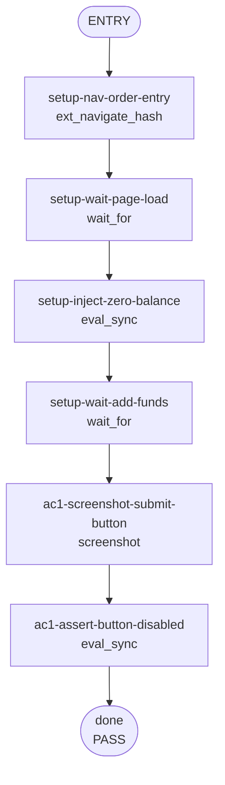

## **Description**

The Long/Short submit button on the perps order entry page was enabled when `availableBalance = 0`. `hasNoAvailableBalance` was computed and used for button text but was not included in `isSubmitDisabled`. Added `hasNoAvailableBalance ||` to the disabled gate — one-line fix.

## **Changelog**

CHANGELOG entry: Fixed a bug where the Long/Short submit button was enabled when the user had no perps balance

## **Related issues**

Fixes: [TAT-2831](https://consensyssoftware.atlassian.net/browse/TAT-2831)

## **Manual testing steps**

1. Open extension on a perps-enabled network
2. Navigate to `/perps/trade/BTC?direction=long&mode=new`
3. Ensure your account has 0 available perps balance
4. Observe: the "Add funds" button is **disabled** (not tappable)

## **Screenshots/Recordings**

### **Before**

<!-- before-ac1-submit-button-state.png -->

### **After**

<!-- after-ac1-submit-button-state.png -->

## **Pre-merge author checklist**

- [x] I've followed [MetaMask Contributor Docs](https://github.com/MetaMask/contributor-docs) and [MetaMask Extension Coding Standards](https://github.com/MetaMask/metamask-extension/blob/main/.github/guidelines/CODING_GUIDELINES.md).
- [x] I've completed the PR template to the best of my ability
- [x] I've included tests if applicable
- [x] I've documented my code using [JSDoc](https://jsdoc.app/) format if applicable
- [x] I've applied the right labels on the PR (see [labeling guidelines](https://github.com/MetaMask/metamask-extension/blob/main/.github/guidelines/LABELING_GUIDELINES.md)). Not required for external contributors.

## **Pre-merge reviewer checklist**

- [ ] I've manually tested the PR (e.g. pull and build branch, run the app, test code being changed).
- [ ] I confirm that this PR addresses all acceptance criteria described in the ticket it closes and includes the necessary testing evidence such as recordings and or screenshots.

## **Validation Recipe**

<details>
<summary>recipe.json</summary>

```json
{
  "title": "TAT-2831: Submit button disabled when user has no perps balance",
  "description": "Verifies that the Long/Short submit button on the perps order entry page is disabled when the user has zero perps balance. Uses stream manager pushData to inject a zero-balance account state, bypassing the Hyperliquid connection requirement.",
  "validate": {
    "workflow": {
      "pre_conditions": ["wallet.unlocked"],
      "entry": "setup-nav-order-entry",
      "nodes": {
        "setup-nav-order-entry": {
          "action": "ext_navigate_hash",
          "hash": "/perps/trade/BTC?direction=long&mode=new",
          "next": "setup-wait-page-load"
        },
        "setup-wait-page-load": {
          "action": "wait_for",
          "test_id": "perps-order-entry-page",
          "timeout_ms": 30000,
          "next": "setup-inject-zero-balance"
        },
        "setup-inject-zero-balance": {
          "action": "eval_sync",
          "expression": "(function(){var sm=stateHooks.getPerpsStreamManager&&stateHooks.getPerpsStreamManager();if(!sm||!sm.account||typeof sm.account.pushData!=='function')return JSON.stringify({injected:false,reason:'no pushData'});sm.account.pushData({availableBalance:'0',totalBalance:'0',unrealizedPnl:'0',positions:[],openOrders:[]});return JSON.stringify({injected:true});})()",
          "assert": { "all": [{ "operator": "eq", "field": "injected", "value": true }] },
          "save_as": "inject_result",
          "next": "setup-wait-add-funds"
        },
        "setup-wait-add-funds": {
          "action": "wait_for",
          "expression": "(function(){var btn=document.querySelector('[data-testid=\"submit-order-button\"]');if(!btn)return JSON.stringify({ready:false});var txt=btn.textContent.trim().toLowerCase();return JSON.stringify({ready:txt.includes('add funds'),txt:txt});})()",
          "assert": { "operator": "eq", "field": "ready", "value": true },
          "timeout_ms": 5000,
          "poll_ms": 200,
          "next": "ac1-screenshot-submit-button"
        },
        "ac1-screenshot-submit-button": {
          "action": "screenshot",
          "filename": "evidence-ac1-submit-button-state.png",
          "next": "ac1-assert-button-disabled"
        },
        "ac1-assert-button-disabled": {
          "action": "eval_sync",
          "expression": "(function(){var btn=document.querySelector('[data-testid=\"submit-order-button\"]');if(!btn)return JSON.stringify({found:false,disabled:null});return JSON.stringify({found:true,disabled:btn.disabled,text:btn.textContent.trim()});})()",
          "assert": {
            "all": [
              { "operator": "eq", "field": "found", "value": true },
              { "operator": "eq", "field": "disabled", "value": true }
            ]
          },
          "save_as": "submit_button_state",
          "next": "done"
        },
        "done": {
          "action": "end",
          "status": "pass",
          "message": "Submit button is correctly disabled when user has no perps balance"
        }
      }
    }
  }
}
```

</details>

## **Recipe Workflow**

<details>
<summary>workflow.mmd</summary>



</details>
