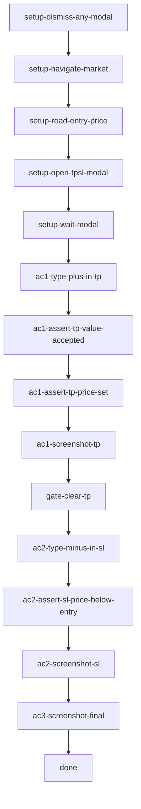

## **Description**

Fixes a bug where users could not type `+` or `-` to set TP/SL thresholds as signed RoE percentages. Three interrelated bugs: `formatRoePercent` stripped the sign, `percentToPriceForEdit`/`percentToPrice` used an `isTP` flag that inverted SL math instead of a unified signed convention, and the input regex rejected `+` as a leading character.

After the fix: positive % = profitable direction, negative % = loss direction. Both TP and SL use the same formula. Typing `+15` or `-10` is accepted and converts to the correct price.

## **Changelog**

CHANGELOG entry: Fixed a bug where typing `+` or `-` in TP/SL percent fields was rejected or produced prices on the wrong side of the entry price.

## **Related issues**

Fixes: [TAT-2947](https://consensyssoftware.atlassian.net/browse/TAT-2947)

## **Manual testing steps**

1. Open MetaMask with an active perps position (long ETH or any asset).
2. Tap the "Auto close" row to open the TP/SL modal.
3. In the Take Profit percent field, type `+15` — verify it is accepted and a price above entry appears.
4. In the Stop Loss percent field, type `-5` — verify it is accepted and a price below entry appears.
5. Verify the sign shown in the percent field matches the input (not stripped on blur).
6. Click an SL preset (e.g. "-5%") — verify the resulting price is below entry.

## **Screenshots/Recordings**

### **Before**

<!-- Gateway will populate from evidence-manifest.json -->

### **After**

<!-- Gateway will populate from evidence-manifest.json -->

## **Pre-merge author checklist**

- [x] I've followed [MetaMask Contributor Docs](https://github.com/MetaMask/contributor-docs) and [MetaMask Extension Coding Standards](https://github.com/MetaMask/metamask-extension/blob/main/.github/guidelines/CODING_GUIDELINES.md).
- [x] I've completed the PR template to the best of my ability
- [x] I've included tests if applicable
- [x] I've documented my code using [JSDoc](https://jsdoc.app/) format if applicable
- [x] I've applied the right labels on the PR (see [labeling guidelines](https://github.com/MetaMask/metamask-extension/blob/main/.github/guidelines/LABELING_GUIDELINES.md)). Not required for external contributors.

## **Pre-merge reviewer checklist**

- [ ] I've manually tested the PR (e.g. pull and build branch, run the app, test code being changed).
- [ ] I confirm that this PR addresses all acceptance criteria described in the ticket it closes and includes the necessary testing evidence such as recordings and or screenshots.

## **Validation Recipe**

<details>
<summary>recipe.json</summary>

```json
{
  "title": "TAT-2947: TP/SL signed percent input — +/- sign acceptance and correct price derivation",
  "description": "Verifies that the TP/SL modal accepts + prefix and that - prefix sets prices on the correct side of entry. Requires an open ETH long position.",
  "initial_conditions": {},
  "validate": {
    "workflow": {
      "pre_conditions": ["wallet.unlocked", "perps.feature_enabled"],
      "entry": "setup-dismiss-any-modal",
      "teardown": [
        {
          "id": "teardown-close-modal",
          "action": "eval_sync",
          "expression": "(()=>{const closeBtn=document.querySelector('[data-testid=\"perps-update-tpsl-modal\"] [aria-label=\"Close\"]');if(closeBtn)closeBtn.click();return JSON.stringify({ok:true});})()",
          "assert": { "operator": "eq", "field": "ok", "value": true }
        }
      ],
      "nodes": {
        "setup-dismiss-any-modal": { "action": "eval_sync", "...": "..." },
        "setup-navigate-market": { "action": "call", "ref": "perps/navigate-to-market-detail", "...": "..." },
        "ac1-type-plus-in-tp": { "action": "eval_sync", "...": "types +15 in TP percent input" },
        "ac1-assert-tp-value-accepted": { "action": "eval_sync", "assert": { "operator": "eq", "field": "accepted", "value": true } },
        "ac2-type-minus-in-sl": { "action": "eval_sync", "...": "types -5 in SL percent input" },
        "ac2-assert-sl-price-below-entry": { "action": "eval_sync", "assert": { "operator": "eq", "field": "belowEntry", "value": true } }
      }
    }
  }
}
```

</details>

## **Recipe Workflow**

<details>
<summary>workflow.mmd</summary>



</details>
