## **Description**

The back button on the Perps market detail page always navigated to `DEFAULT_ROUTE` (wallet home), ignoring browser history. Changed `navigate(DEFAULT_ROUTE)` to `navigate(-1)` in `handleBackClick` so the browser traverses its history stack, returning users to the correct previous screen and restoring scroll position.

## **Changelog**

CHANGELOG entry: Fixed a bug where the back button on the Perps market detail page always redirected to wallet home instead of the previous screen.

## **Related issues**

Fixes: [TAT-2965](https://consensyssoftware.atlassian.net/browse/TAT-2965)

## **Manual testing steps**

1. Open MetaMask, go to the Perps tab on wallet home
2. Click "Explore markets" (the arrow) to open the market list
3. Click any market (e.g. ETH) to open its detail page
4. Tap the back (←) button — you should return to the market list (not wallet home)
5. Also verify: from wallet home Perps tab, click a market card directly, then press back — you return to wallet home with scroll position intact

## **Screenshots/Recordings**

<!-- Gateway will replace this section using evidence-manifest.json -->

### **Before**

Back button from market detail always navigated to wallet home (market list context lost).

### **After**

Back button returns to the previous screen in browser history (market list or home, as appropriate).

## **Pre-merge author checklist**

- [x] I've followed [MetaMask Contributor Docs](https://github.com/MetaMask/contributor-docs) and [MetaMask Extension Coding Standards](https://github.com/MetaMask/metamask-extension/blob/main/.github/guidelines/CODING_GUIDELINES.md).
- [x] I've completed the PR template to the best of my ability
- [x] I've included tests if applicable
- [x] I've documented my code using [JSDoc](https://jsdoc.app/) format if applicable
- [x] I've applied the right labels on the PR (see [labeling guidelines](https://github.com/MetaMask/metamask-extension/blob/main/.github/guidelines/LABELING_GUIDELINES.md)). Not required for external contributors.

## **Pre-merge reviewer checklist**

- [ ] I've manually tested the PR (e.g. pull and build branch, run the app, test code being changed).
- [ ] I confirm that this PR addresses all acceptance criteria described in the ticket it closes and includes the necessary testing evidence such as recordings and or screenshots.

## **Validation Recipe**

<details>
<summary>recipe.json</summary>

```json
{
  "title": "Perps back navigation — market list and home scroll position",
  "description": "Proves that pressing back on the market detail page returns the user to the correct previous screen (market list or wallet home) rather than always navigating to DEFAULT_ROUTE.",
  "validate": {
    "workflow": {
      "pre_conditions": ["wallet.unlocked", "perps.feature_enabled"],
      "entry": "setup-nav-perps",
      "nodes": {
        "setup-nav-perps": {
          "action": "call",
          "ref": "perps/navigate-perps-tab",
          "next": "setup-nav-market-list"
        },
        "setup-nav-market-list": {
          "action": "navigate",
          "target": "PerpsMarketList",
          "next": "setup-wait-market-list"
        },
        "setup-wait-market-list": {
          "action": "wait_for",
          "test_id": "market-list-view",
          "timeout_ms": 10000,
          "next": "setup-screenshot-market-list"
        },
        "setup-screenshot-market-list": {
          "action": "screenshot",
          "filename": "evidence-ac1-before-market-list.png",
          "next": "setup-nav-to-detail"
        },
        "setup-nav-to-detail": {
          "action": "call",
          "ref": "perps/navigate-to-market-detail",
          "params": { "symbol": "ETH" },
          "next": "gate-wait-detail"
        },
        "gate-wait-detail": {
          "action": "wait_for",
          "test_id": "perps-market-detail-page",
          "timeout_ms": 10000,
          "next": "ac1-screenshot-on-detail"
        },
        "ac1-screenshot-on-detail": {
          "action": "screenshot",
          "filename": "evidence-ac1-on-market-detail.png",
          "next": "ac1-press-back"
        },
        "ac1-press-back": {
          "action": "press",
          "test_id": "perps-market-detail-back-button",
          "next": "ac1-wait-for-market-list"
        },
        "ac1-wait-for-market-list": {
          "action": "wait_for",
          "test_id": "market-list-view",
          "timeout_ms": 5000,
          "next": "ac1-assert-on-market-list"
        },
        "ac1-assert-on-market-list": {
          "action": "eval_sync",
          "expression": "JSON.stringify({ onMarketList: !!document.querySelector('[data-testid=\"market-list-view\"]'), hash: window.location.hash })",
          "assert": {
            "all": [
              { "operator": "eq", "field": "onMarketList", "value": true }
            ]
          },
          "save_as": "back_nav_result",
          "next": "ac1-screenshot-back-result"
        },
        "ac1-screenshot-back-result": {
          "action": "screenshot",
          "filename": "evidence-ac1-after-back-on-market-list.png",
          "next": "setup-nav-home-for-ac2"
        },
        "setup-nav-home-for-ac2": {
          "action": "navigate",
          "target": "Home",
          "next": "setup-wait-home"
        },
        "setup-wait-home": {
          "action": "wait_for",
          "test_id": "account-menu-icon",
          "timeout_ms": 10000,
          "next": "setup-screenshot-home"
        },
        "setup-screenshot-home": {
          "action": "screenshot",
          "filename": "evidence-ac2-on-home.png",
          "next": "setup-nav-detail-from-home"
        },
        "setup-nav-detail-from-home": {
          "action": "call",
          "ref": "perps/navigate-to-market-detail",
          "params": { "symbol": "BTC" },
          "next": "gate-wait-detail-ac2"
        },
        "gate-wait-detail-ac2": {
          "action": "wait_for",
          "test_id": "perps-market-detail-page",
          "timeout_ms": 10000,
          "next": "ac2-screenshot-detail"
        },
        "ac2-screenshot-detail": {
          "action": "screenshot",
          "filename": "evidence-ac2-on-market-detail.png",
          "next": "ac2-press-back"
        },
        "ac2-press-back": {
          "action": "press",
          "test_id": "perps-market-detail-back-button",
          "next": "ac2-wait-for-home"
        },
        "ac2-wait-for-home": {
          "action": "wait_for",
          "test_id": "account-menu-icon",
          "timeout_ms": 5000,
          "next": "ac2-assert-on-home"
        },
        "ac2-assert-on-home": {
          "action": "eval_sync",
          "expression": "JSON.stringify({ onHome: !!document.querySelector('[data-testid=\"account-menu-icon\"]'), notOnDetail: !document.querySelector('[data-testid=\"perps-market-detail-page\"]'), hash: window.location.hash })",
          "assert": {
            "all": [
              { "operator": "eq", "field": "onHome", "value": true },
              { "operator": "eq", "field": "notOnDetail", "value": true }
            ]
          },
          "save_as": "home_back_nav_result",
          "next": "ac2-screenshot-back-home"
        },
        "ac2-screenshot-back-home": {
          "action": "screenshot",
          "filename": "evidence-ac2-after-back-on-home.png",
          "next": "done"
        },
        "done": {
          "action": "end",
          "status": "pass",
          "message": "Back navigation from market detail returns to correct previous screen"
        }
      }
    }
  }
}
```

</details>

## **Recipe Workflow**

```mermaid
flowchart TD
  %% Perps back navigation — market list and home scroll position
  __entry__(["ENTRY"]) --> node_setup_nav_perps
  node_setup_nav_perps[["setup-nav-perps<br/>perps/navigate-perps-tab"]]
  node_setup_nav_market_list["setup-nav-market-list<br/>navigate"]
  node_setup_wait_market_list["setup-wait-market-list<br/>wait_for"]
  node_setup_screenshot_market_list["setup-screenshot-market-list<br/>screenshot"]
  node_setup_nav_to_detail[["setup-nav-to-detail<br/>perps/navigate-to-market-detail"]]
  node_gate_wait_detail["gate-wait-detail<br/>wait_for"]
  node_ac1_screenshot_on_detail["ac1-screenshot-on-detail<br/>screenshot"]
  node_ac1_press_back["ac1-press-back<br/>press"]
  node_ac1_wait_for_market_list["ac1-wait-for-market-list<br/>wait_for"]
  node_ac1_assert_on_market_list["ac1-assert-on-market-list<br/>eval_sync"]
  node_ac1_screenshot_back_result["ac1-screenshot-back-result<br/>screenshot"]
  node_setup_nav_home_for_ac2["setup-nav-home-for-ac2<br/>navigate"]
  node_setup_wait_home["setup-wait-home<br/>wait_for"]
  node_setup_screenshot_home["setup-screenshot-home<br/>screenshot"]
  node_setup_nav_detail_from_home[["setup-nav-detail-from-home<br/>perps/navigate-to-market-detail"]]
  node_gate_wait_detail_ac2["gate-wait-detail-ac2<br/>wait_for"]
  node_ac2_screenshot_detail["ac2-screenshot-detail<br/>screenshot"]
  node_ac2_press_back["ac2-press-back<br/>press"]
  node_ac2_wait_for_home["ac2-wait-for-home<br/>wait_for"]
  node_ac2_assert_on_home["ac2-assert-on-home<br/>eval_sync"]
  node_ac2_screenshot_back_home["ac2-screenshot-back-home<br/>screenshot"]
  node_done(["done<br/>PASS"])
  node_setup_nav_perps --> node_setup_nav_market_list
  node_setup_nav_market_list --> node_setup_wait_market_list
  node_setup_wait_market_list --> node_setup_screenshot_market_list
  node_setup_screenshot_market_list --> node_setup_nav_to_detail
  node_setup_nav_to_detail --> node_gate_wait_detail
  node_gate_wait_detail --> node_ac1_screenshot_on_detail
  node_ac1_screenshot_on_detail --> node_ac1_press_back
  node_ac1_press_back --> node_ac1_wait_for_market_list
  node_ac1_wait_for_market_list --> node_ac1_assert_on_market_list
  node_ac1_assert_on_market_list --> node_ac1_screenshot_back_result
  node_ac1_screenshot_back_result --> node_setup_nav_home_for_ac2
  node_setup_nav_home_for_ac2 --> node_setup_wait_home
  node_setup_wait_home --> node_setup_screenshot_home
  node_setup_screenshot_home --> node_setup_nav_detail_from_home
  node_setup_nav_detail_from_home --> node_gate_wait_detail_ac2
  node_gate_wait_detail_ac2 --> node_ac2_screenshot_detail
  node_ac2_screenshot_detail --> node_ac2_press_back
  node_ac2_press_back --> node_ac2_wait_for_home
  node_ac2_wait_for_home --> node_ac2_assert_on_home
  node_ac2_assert_on_home --> node_ac2_screenshot_back_home
  node_ac2_screenshot_back_home --> node_done
```

<details>
<summary>workflow.mmd</summary>



</details>
