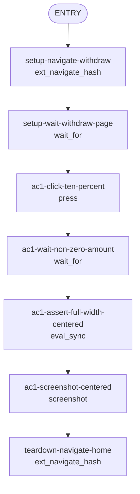

## **Description**

The hero amount input (`$X.XX`) in the perps withdraw flow was left-aligned in the narrow popup viewport. The `PerpsFiatHeroAmountInput` container was content-sized (~82% of parent width) rather than full-width, causing the amount to hug the left edge in popup mode.

Fixed by adding `className="w-full"` to the container box, ensuring `justify-content: center` correctly centers the `[$][amount]` at all viewport widths.

## **Changelog**

CHANGELOG entry: null

## **Related issues**

Fixes: [TAT-2847](https://consensyssoftware.atlassian.net/browse/TAT-2847)

## **Manual testing steps**

1. Open the MetaMask extension in popup mode (360px wide).
2. Navigate to the Perps section and click **Withdraw**.
3. Click **10%** (or any percentage button) to set a non-zero amount.
4. Verify the `$X.XX` amount is horizontally centered — equal left and right margins, aligned with the balance text and percentage buttons below it.

## **Screenshots/Recordings**

<!-- Gateway will replace this section with evidence from evidence-manifest.json -->

### **Before**

Input left-aligned in popup mode (container was content-sized, 82% of parent width).

### **After**

Input centered at all viewport sizes (container is now full-width, content centered via justify-content).

## **Pre-merge author checklist**

- [x] I've followed [MetaMask Contributor Docs](https://github.com/MetaMask/contributor-docs) and [MetaMask Extension Coding Standards](https://github.com/MetaMask/metamask-extension/blob/main/.github/guidelines/CODING_GUIDELINES.md).
- [x] I've completed the PR template to the best of my ability
- [x] I've included tests if applicable
- [x] I've documented my code using [JSDoc](https://jsdoc.app/) format if applicable
- [x] I've applied the right labels on the PR (see [labeling guidelines](https://github.com/MetaMask/metamask-extension/blob/main/.github/guidelines/LABELING_GUIDELINES.md)). Not required for external contributors.

## **Pre-merge reviewer checklist**

- [ ] I've manually tested the PR (e.g. pull and build branch, run the app, test code being changed).
- [ ] I confirm that this PR addresses all acceptance criteria described in the ticket it closes and includes the necessary testing evidence such as recordings and or screenshots.

## **Validation Recipe**

<details>
<summary>recipe.json</summary>

```json
{
  "title": "Perps withdraw input centering proof",
  "description": "Validates that the hero fiat amount input container is full-width and content is centered in the perps withdraw flow. Without w-full, the container is content-sized (~82% of parent) causing left-alignment in narrow popup viewports.",
  "validate": {
    "workflow": {
      "pre_conditions": ["wallet.unlocked", "perps.feature_enabled"],
      "entry": "setup-navigate-withdraw",
      "nodes": {
        "setup-navigate-withdraw": {
          "action": "ext_navigate_hash",
          "hash": "/perps/withdraw",
          "next": "setup-wait-withdraw-page"
        },
        "setup-wait-withdraw-page": {
          "action": "wait_for",
          "test_id": "perps-withdraw-page",
          "timeout": 5000,
          "next": "ac1-click-ten-percent"
        },
        "ac1-click-ten-percent": {
          "action": "press",
          "test_id": "perps-withdraw-percentage-10",
          "next": "ac1-wait-non-zero-amount"
        },
        "ac1-wait-non-zero-amount": {
          "action": "wait_for",
          "test_id": "perps-fiat-hero-amount-input",
          "timeout": 3000,
          "next": "ac1-assert-full-width-centered"
        },
        "ac1-assert-full-width-centered": {
          "action": "eval_sync",
          "expression": "...(bounding-box centering assertion)...",
          "assert": {
            "all": [
              { "operator": "eq", "field": "heroFillsParent", "value": true },
              { "operator": "eq", "field": "contentCentered", "value": true }
            ]
          },
          "save_as": "centering_result",
          "next": "ac1-screenshot-centered"
        },
        "ac1-screenshot-centered": {
          "action": "screenshot",
          "filename": "evidence-ac1-withdraw-input-centered.png",
          "next": "teardown-navigate-home"
        },
        "teardown-navigate-home": {
          "action": "ext_navigate_hash",
          "hash": "/",
          "end": true
        }
      }
    }
  }
}
```

</details>

## **Recipe Workflow**

<details>
<summary>workflow.mmd</summary>



</details>
