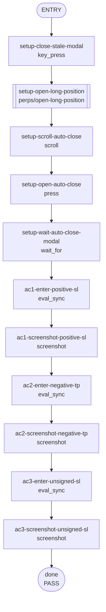

<!--
Please submit this PR as a draft initially.
Do not mark it as "Ready for review" until the template has been completely filled out, and PR status checks have passed at least once.
-->

## **Description**

Fixes TP/SL RoE percent inputs in the Perps Auto close modal so signed values remain clear after the trigger price is recalculated. Explicit positive SL values such as `+15` now keep the `+` sign after blur, explicit negative TP values keep the `-` sign, and unsigned long SL input continues to default negative.

## **Changelog**

CHANGELOG entry: Fixed a bug that caused Perps TP/SL RoE signs to disappear or default incorrectly in the Auto close modal

## **Related issues**

Fixes: [TAT-2947](https://consensyssoftware.atlassian.net/browse/TAT-2947)

## **Manual testing steps**

1. Open a long Perps position and open the Auto close modal.
2. Enter `+15` in the Stop loss percent input, then blur the field and confirm it still displays a positive sign.
3. Enter `-15` in the Take profit percent input, then blur the field and confirm it still displays a negative sign.
4. Enter `5` in the Stop loss percent input for the long position and confirm it defaults to `-5`.

## **Screenshots/Recordings**

TP/SL RoE inputs preserve explicit signs, and unsigned long stop loss defaults negative.

<table>
<tr><td align="center" width="50%"><strong>Auto close modal — positive SL RoE sign preserved</strong><br/></td><td align="center" width="50%"><strong>Auto close modal — negative TP RoE sign preserved</strong><br/></td></tr>
<tr><td align="center" width="50%"><strong>Auto close modal — unsigned long SL defaults negative</strong><br/></td><td></td></tr>
</table>


**Video**
Videos captured the recipe before and after the fix; screenshots are preferred for PR embedding.
<table>
<tr><td align="center" width="50%"><em>Before</em><br/><a href="https://raw.githubusercontent.com/abretonc7s/mm-extension-farm-artifacts/main/fixes/42284/before.mp4">before.mp4</a></td>
<td align="center" width="50%"><em>After</em><br/><a href="https://raw.githubusercontent.com/abretonc7s/mm-extension-farm-artifacts/main/fixes/42284/after.mp4">after.mp4</a></td></tr>
</table>

## **Pre-merge author checklist**

- [x] I've followed [MetaMask Contributor Docs](https://github.com/MetaMask/contributor-docs) and [MetaMask Extension Coding Standards](https://github.com/MetaMask/metamask-extension/blob/main/.github/guidelines/CODING_GUIDELINES.md).
- [x] I've completed the PR template to the best of my ability
- [x] I’ve included tests if applicable
- [x] I’ve documented my code using [JSDoc](https://jsdoc.app/) format if applicable
- [x] I’ve applied the right labels on the PR (see [labeling guidelines](https://github.com/MetaMask/metamask-extension/blob/main/.github/guidelines/LABELING_GUIDELINES.md)). Not required for external contributors.

## **Pre-merge reviewer checklist**

- [ ] I've manually tested the PR (e.g. pull and build branch, run the app, test code being changed).
- [ ] I confirm that this PR addresses all acceptance criteria described in the ticket it closes and includes the necessary testing evidence such as recordings and or screenshots.

## **Validation Recipe**

<details>
<summary>recipe.json</summary>

```json
{
  "schema_version": 1,
  "title": "TAT-2947 — TP/SL RoE sign entry",
  "description": "Validates signed RoE input in the Perps Auto close modal for TP/SL thresholds.",
  "validate": {
    "workflow": {
      "pre_conditions": ["wallet.unlocked", "perps.feature_enabled"],
      "entry": "setup-close-stale-modal",
      "nodes": {
        "setup-close-stale-modal": {
          "action": "key_press",
          "key": "Escape",
          "next": "setup-open-long-position"
        },
        "setup-open-long-position": {
          "action": "call",
          "ref": "perps/open-long-position",
          "params": { "symbol": "ETH", "side": "long", "amount": "10" },
          "next": "setup-scroll-auto-close"
        },
        "setup-scroll-auto-close": {
          "action": "scroll",
          "test_id": "perps-auto-close-row",
          "next": "setup-open-auto-close"
        },
        "setup-open-auto-close": {
          "action": "press",
          "test_id": "perps-auto-close-row",
          "next": "setup-wait-auto-close-modal"
        },
        "setup-wait-auto-close-modal": {
          "action": "wait_for",
          "expression": "!!(document.querySelector('[data-testid=\"perps-update-tpsl-tp-percent-input\"]') && document.querySelector('[data-testid=\"perps-update-tpsl-sl-percent-input\"]') && document.querySelector('[data-testid=\"perps-update-tpsl-tp-price-input\"]') && document.querySelector('[data-testid=\"perps-update-tpsl-sl-price-input\"]'))",
          "timeout_ms": 10000,
          "next": "ac1-enter-positive-sl"
        },
        "ac1-enter-positive-sl": {
          "action": "eval_sync",
          "expression": "(function(){const slPrice=document.querySelector('[data-testid=\"perps-update-tpsl-sl-price-input\"]'); const slPercent=document.querySelector('[data-testid=\"perps-update-tpsl-sl-percent-input\"]'); const setter=Object.getOwnPropertyDescriptor(HTMLInputElement.prototype,'value').set; setter.call(slPrice,''); slPrice.dispatchEvent(new Event('input',{bubbles:true})); slPrice.dispatchEvent(new Event('change',{bubbles:true})); slPercent.focus(); setter.call(slPercent,'+15'); slPercent.dispatchEvent(new Event('input',{bubbles:true})); slPercent.dispatchEvent(new Event('change',{bubbles:true})); slPercent.blur(); return JSON.stringify({slPercent:slPercent.value, slPrice:slPrice.value, hasPositiveSign:slPercent.value.startsWith('+')});})()",
          "assert": { "operator": "eq", "field": "hasPositiveSign", "value": true },
          "save_as": "ac1_positive_sl",
          "next": "ac1-screenshot-positive-sl"
        },
        "ac1-screenshot-positive-sl": {
          "action": "screenshot",
          "filename": "evidence-ac1-positive-sl-sign",
          "note": "AC1: SL RoE entered as +15 remains visibly positive after blur.",
          "next": "ac2-enter-negative-tp"
        },
        "ac2-enter-negative-tp": {
          "action": "eval_sync",
          "expression": "(function(){const tpPrice=document.querySelector('[data-testid=\"perps-update-tpsl-tp-price-input\"]'); const tpPercent=document.querySelector('[data-testid=\"perps-update-tpsl-tp-percent-input\"]'); const setter=Object.getOwnPropertyDescriptor(HTMLInputElement.prototype,'value').set; setter.call(tpPrice,''); tpPrice.dispatchEvent(new Event('input',{bubbles:true})); tpPrice.dispatchEvent(new Event('change',{bubbles:true})); tpPercent.focus(); setter.call(tpPercent,'-15'); tpPercent.dispatchEvent(new Event('input',{bubbles:true})); tpPercent.dispatchEvent(new Event('change',{bubbles:true})); tpPercent.blur(); return JSON.stringify({tpPercent:tpPercent.value, tpPrice:tpPrice.value, hasNegativeSign:tpPercent.value.startsWith('-')});})()",
          "assert": { "operator": "eq", "field": "hasNegativeSign", "value": true },
          "save_as": "ac2_negative_tp",
          "next": "ac2-screenshot-negative-tp"
        },
        "ac2-screenshot-negative-tp": {
          "action": "screenshot",
          "filename": "evidence-ac2-negative-tp-sign",
          "note": "AC2: TP RoE entered as -15 remains visibly negative after blur.",
          "next": "ac3-enter-unsigned-sl"
        },
        "ac3-enter-unsigned-sl": {
          "action": "eval_sync",
          "expression": "(function(){const slPrice=document.querySelector('[data-testid=\"perps-update-tpsl-sl-price-input\"]'); const slPercent=document.querySelector('[data-testid=\"perps-update-tpsl-sl-percent-input\"]'); const setter=Object.getOwnPropertyDescriptor(HTMLInputElement.prototype,'value').set; setter.call(slPrice,''); slPrice.dispatchEvent(new Event('input',{bubbles:true})); slPrice.dispatchEvent(new Event('change',{bubbles:true})); slPercent.focus(); setter.call(slPercent,'5'); slPercent.dispatchEvent(new Event('input',{bubbles:true})); slPercent.dispatchEvent(new Event('change',{bubbles:true})); return JSON.stringify({slPercent:slPercent.value, slPrice:slPrice.value, defaultedNegative:slPercent.value.startsWith('-')});})()",
          "assert": { "operator": "eq", "field": "defaultedNegative", "value": true },
          "save_as": "ac3_unsigned_sl",
          "next": "ac3-screenshot-unsigned-sl"
        },
        "ac3-screenshot-unsigned-sl": {
          "action": "screenshot",
          "filename": "evidence-ac3-unsigned-sl-negative",
          "note": "AC3: unsigned SL RoE input 5 defaults to a negative -5 value for a long position.",
          "next": "done"
        },
        "done": {
          "action": "end",
          "status": "pass",
          "message": "TP/SL signed RoE inputs preserve explicit signs and default unsigned long SL values negative."
        }
      }
    }
  }
}
```
</details>

## **Recipe Workflow**

<details>
<summary>workflow.mmd</summary>


</details>

[TAT-2947]: https://consensyssoftware.atlassian.net/browse/TAT-2947?atlOrigin=eyJpIjoiNWRkNTljNzYxNjVmNDY3MDlhMDU5Y2ZhYzA5YTRkZjUiLCJwIjoiZ2l0aHViLWNvbS1KU1cifQ

<!-- CURSOR_SUMMARY -->
---

> [!NOTE]
> **Low Risk**
> UI-only formatting and test changes scoped to TP/SL percent display; minimal risk beyond potential regressions in RoE% string formatting.
> 
> **Overview**
> Fixes Perps Auto Close TP/SL RoE% formatting so **explicit positive values remain prefixed with `+` after blur/recalculation**, instead of being displayed unsigned.
> 
> This introduces `formatSignedRoePercent` and routes `priceToPercentForEdit` through it, adds `testId`s to the TP/SL price and percent `TextField`s, and extends unit tests to assert sign preservation for explicit `+` SL and `-` TP inputs (while keeping the existing default-negative behavior for unsigned long SL).
> 
> <sup>Reviewed by [Cursor Bugbot](https://cursor.com/bugbot) for commit e54103d858e5aa9f4d26831af530a6fcbab83c78. Bugbot is set up for automated code reviews on this repo. Configure [here](https://www.cursor.com/dashboard/bugbot).</sup>
<!-- /CURSOR_SUMMARY -->

