## **Description**

A position-level TP/SL (positionTPSL) created from the order entry screen was rendered in the orders list of the market detail page instead of the auto-close section, leaving the auto-close section empty and duplicating the entry under Orders.

The extension's `shouldDisplayOrderInMarketDetailsOrders` predicate was a permanent `() => true`, so `normalizeMarketDetailsOrders` kept full-position TP/SL rows in the orders list. This change aligns the predicate with the mobile rule (`metamask-mobile/app/components/UI/Perps/utils/orderUtils.ts`): non-reduce-only orders pass through unchanged, while reduce-only orders associated with the full position are filtered out. The auto-close section already reads `position.takeProfitPrice` / `position.stopLossPrice`, so removing the duplicate from Orders fully resolves the bug without any new state plumbing.

## **Changelog**

CHANGELOG entry: Fixed a perps bug where a position-level TP/SL appeared in the orders list of the market detail page instead of the auto-close section.

## **Related issues**

Fixes: [TAT-3075](https://consensyssoftware.atlassian.net/browse/TAT-3075)

## **Manual testing steps**

1. Unlock MetaMask and open the Perps tab.
2. Pick a market (for example, BTC) and open the order entry screen.
3. Expand the auto-close section, set a TP and/or SL, and submit the order so a position opens with a positionTPSL.
4. Navigate to the market detail page (`/perps/market/BTC`).
5. Verify the auto-close section shows the TP/SL prices.
6. Verify the orders list does NOT contain a separate TP/SL row for the positionTPSL.
7. Place a limit order with order-level TP/SL on the same market without a position. Verify the synthetic TP/SL rows appear in the orders list and the auto-close section is not rendered.

## **Screenshots/Recordings**

### **Before**

<!-- gateway will attach the before screenshot -->

### **After**

<!-- gateway will attach the after screenshot -->

## **Pre-merge author checklist**

- [x] I've followed [MetaMask Contributor Docs](https://github.com/MetaMask/contributor-docs) and [MetaMask Extension Coding Standards](https://github.com/MetaMask/metamask-extension/blob/main/.github/guidelines/CODING_GUIDELINES.md).
- [x] I've completed the PR template to the best of my ability
- [x] I’ve included tests if applicable
- [x] I’ve documented my code using [JSDoc](https://jsdoc.app/) format if applicable
- [x] I’ve applied the right labels on the PR (see [labeling guidelines](https://github.com/MetaMask/metamask-extension/blob/main/.github/guidelines/LABELING_GUIDELINES.md)). Not required for external contributors.

## **Pre-merge reviewer checklist**

- [ ] I've manually tested the PR (e.g. pull and build branch, run the app, test code being changed).
- [ ] I confirm that this PR addresses all acceptance criteria described in the ticket it closes and includes the necessary testing evidence such as recordings and or screenshots.

## **Validation Recipe**

<details>
<summary>recipe.json</summary>

```json
{
  "title": "TAT-3075 — positionTPSL appears in auto-close section, not order section",
  "description": "Validates that a position-level TP/SL renders in the auto-close section of the market detail page only, and that an order-level TP/SL renders in the orders list only. Mock data is injected into the live PerpsStreamManager via stateHooks so the test runs without spending funds on a real position.",
  "schema_version": 1,
  "validate": {
    "workflow": {
      "pre_conditions": ["wallet.unlocked", "perps.feature_enabled"],
      "setup": [
        { "id": "setup-nav-perps", "action": "call", "ref": "perps/navigate-perps-tab" }
      ],
      "teardown": [
        {
          "id": "teardown-clear-injections",
          "action": "eval_sync",
          "expression": "(function(){try{var sm=stateHooks.getPerpsStreamManager();if(sm){sm.positions.pushData([]);sm.orders.pushData([]);}return JSON.stringify({cleared:true})}catch(e){return JSON.stringify({cleared:false,error:String(e&&e.message||e)})}})()",
          "assert": { "operator": "eq", "field": "cleared", "value": true }
        }
      ],
      "entry": "setup-nav-detail-btc",
      "nodes": {
        "setup-nav-detail-btc": { "action": "call", "ref": "perps/navigate-to-market-detail", "params": { "symbol": "BTC" }, "next": "setup-wait-detail" },
        "setup-wait-detail": { "action": "wait_for", "test_id": "perps-market-detail-page", "timeout_ms": 10000, "next": "ac1-inject-position-with-positiontpsl" },
        "ac1-inject-position-with-positiontpsl": {
          "action": "eval_sync",
          "expression": "(stateHooks injection: BTC position with takeProfitPrice 99000 / stopLossPrice 90000 + 2 reduce-only positionTpsl orders)",
          "assert": { "operator": "eq", "field": "injected", "value": true },
          "next": "ac1-wait-auto-close-row"
        },
        "ac1-wait-auto-close-row": { "action": "wait_for", "test_id": "perps-auto-close-row", "timeout_ms": 5000, "next": "ac1-scroll-to-auto-close" },
        "ac1-scroll-to-auto-close": { "action": "eval_sync", "expression": "scrollIntoView + parent scroll fix-up", "next": "ac1-assert-auto-close-shows-tpsl" },
        "ac1-assert-auto-close-shows-tpsl": {
          "action": "eval_sync",
          "expression": "read perps-auto-close-row textContent for $99,000 + $90,000",
          "assert": { "all": [ { "operator": "eq", "field": "rendered", "value": true }, { "operator": "eq", "field": "hasTp", "value": true }, { "operator": "eq", "field": "hasSl", "value": true } ] },
          "next": "ac1-screenshot-auto-close"
        },
        "ac1-screenshot-auto-close": { "action": "screenshot", "filename": "evidence-ac1-auto-close-shows-positiontpsl.png", "note": "AC1: auto-close section shows the positionTPSL prices on /perps/market/BTC.", "next": "ac1-assert-positiontpsl-not-in-orders-list" },
        "ac1-assert-positiontpsl-not-in-orders-list": {
          "action": "eval_sync",
          "expression": "querySelector for order-card-<positionTpslId> — must be null",
          "assert": { "all": [ { "operator": "eq", "field": "tpInOrders", "value": false }, { "operator": "eq", "field": "slInOrders", "value": false } ] },
          "next": "ac1-scroll-to-orders-section"
        },
        "ac1-scroll-to-orders-section": { "action": "eval_sync", "expression": "scroll the perps detail page container to bottom", "next": "ac1-screenshot-orders-list" },
        "ac1-screenshot-orders-list": { "action": "screenshot", "filename": "evidence-ac1-orders-list-no-positiontpsl.png", "note": "AC1+AC3: orders list does NOT contain the positionTPSL rows.", "next": "ac2-clear-and-inject-orderlevel-tpsl" },
        "ac2-clear-and-inject-orderlevel-tpsl": {
          "action": "eval_sync",
          "expression": "clear positions; push parent buy-limit order with takeProfitPrice/stopLossPrice (no positionTpsl)",
          "assert": { "operator": "eq", "field": "injected", "value": true },
          "next": "ac2-wait-rerender"
        },
        "ac2-wait-rerender": { "action": "wait_for", "test_id": "order-card-tat3075-orderlevel-parent-1", "timeout_ms": 5000, "next": "ac2-scroll-to-orders" },
        "ac2-scroll-to-orders": { "action": "scroll", "test_id": "order-card-tat3075-orderlevel-parent-1", "next": "ac2-assert-orderlevel-tpsl-in-orders" },
        "ac2-assert-orderlevel-tpsl-in-orders": {
          "action": "eval_sync",
          "expression": "querySelector for parent + synthetic-tp + synthetic-sl + perps-auto-close-row",
          "assert": { "all": [
            { "operator": "eq", "field": "parentInOrders", "value": true },
            { "operator": "eq", "field": "syntheticTpInOrders", "value": true },
            { "operator": "eq", "field": "syntheticSlInOrders", "value": true },
            { "operator": "eq", "field": "autoCloseRendered", "value": false }
          ] },
          "next": "ac2-screenshot-orders-list"
        },
        "ac2-screenshot-orders-list": { "action": "screenshot", "filename": "evidence-ac2-orderlevel-tpsl-in-orders-list.png", "note": "AC2+AC3: order-level TP/SL renders synthetic rows in orders list with no auto-close section.", "next": "done" },
        "done": { "action": "end", "status": "pass" }
      }
    }
  }
}
```

</details>

## **Recipe Workflow**

```mermaid
flowchart TD
  %% TAT-3075 — positionTPSL appears in auto-close section, not order section
  __entry__(["ENTRY"]) --> node_setup_nav_detail_btc
  node_setup_nav_detail_btc[["setup-nav-detail-btc<br/>perps/navigate-to-market-detail"]]
  node_setup_wait_detail["setup-wait-detail<br/>wait_for"]
  node_ac1_inject_position_with_positiontpsl["ac1-inject-position-with-positiontpsl<br/>eval_sync"]
  node_ac1_wait_auto_close_row["ac1-wait-auto-close-row<br/>wait_for"]
  node_ac1_scroll_to_auto_close["ac1-scroll-to-auto-close<br/>eval_sync"]
  node_ac1_assert_auto_close_shows_tpsl["ac1-assert-auto-close-shows-tpsl<br/>eval_sync"]
  node_ac1_screenshot_auto_close["ac1-screenshot-auto-close<br/>screenshot"]
  node_ac1_assert_positiontpsl_not_in_orders_list["ac1-assert-positiontpsl-not-in-orders-list<br/>eval_sync"]
  node_ac1_scroll_to_orders_section["ac1-scroll-to-orders-section<br/>eval_sync"]
  node_ac1_screenshot_orders_list["ac1-screenshot-orders-list<br/>screenshot"]
  node_ac2_clear_and_inject_orderlevel_tpsl["ac2-clear-and-inject-orderlevel-tpsl<br/>eval_sync"]
  node_ac2_wait_rerender["ac2-wait-rerender<br/>wait_for"]
  node_ac2_scroll_to_orders["ac2-scroll-to-orders<br/>scroll"]
  node_ac2_assert_orderlevel_tpsl_in_orders["ac2-assert-orderlevel-tpsl-in-orders<br/>eval_sync"]
  node_ac2_screenshot_orders_list["ac2-screenshot-orders-list<br/>screenshot"]
  node_done(["done<br/>PASS"])
  node_setup_nav_detail_btc --> node_setup_wait_detail
  node_setup_wait_detail --> node_ac1_inject_position_with_positiontpsl
  node_ac1_inject_position_with_positiontpsl --> node_ac1_wait_auto_close_row
  node_ac1_wait_auto_close_row --> node_ac1_scroll_to_auto_close
  node_ac1_scroll_to_auto_close --> node_ac1_assert_auto_close_shows_tpsl
  node_ac1_assert_auto_close_shows_tpsl --> node_ac1_screenshot_auto_close
  node_ac1_screenshot_auto_close --> node_ac1_assert_positiontpsl_not_in_orders_list
  node_ac1_assert_positiontpsl_not_in_orders_list --> node_ac1_scroll_to_orders_section
  node_ac1_scroll_to_orders_section --> node_ac1_screenshot_orders_list
  node_ac1_screenshot_orders_list --> node_ac2_clear_and_inject_orderlevel_tpsl
  node_ac2_clear_and_inject_orderlevel_tpsl --> node_ac2_wait_rerender
  node_ac2_wait_rerender --> node_ac2_scroll_to_orders
  node_ac2_scroll_to_orders --> node_ac2_assert_orderlevel_tpsl_in_orders
  node_ac2_assert_orderlevel_tpsl_in_orders --> node_ac2_screenshot_orders_list
  node_ac2_screenshot_orders_list --> node_done
```

<details>
<summary>workflow.mmd</summary>



</details>
