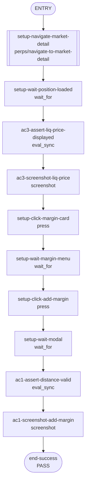

## **Description**

When a perps position has a liquidation price ≤ $0 (possible with very high leverage or cross margin), the extension displayed "0%" for liquidation distance and "$0.00" for liquidation price. Fixed by treating invalid liquidation prices as unavailable (`--`) and aligning edit-margin liquidation distance with mobile's whole-percent display.

## **Changelog**

CHANGELOG entry: Fixed liquidation price/distance fallbacks when liquidation price is at or below zero, and aligned edit-margin liquidation-distance formatting with mobile whole-percent display

## **Related issues**

Fixes: [TAT-3012](https://consensyssoftware.atlassian.net/browse/TAT-3012)

## **Manual testing steps**

1. Open Extension and navigate to Perps tab
2. Open or have a position with very high leverage such that liquidation price is ≤ $0
3. Observe the liquidation price on the market detail page — should show "--"
4. Open "Add margin" modal — liquidation price and liquidation distance should show "--" for the invalid liquidation price
5. Open "Remove margin" modal — the same unavailable fallback should apply; valid liquidation distances should use whole-percent display

## **Self-review validation**

- Added direct unit assertions for edit-margin liquidation price fallback using `perps-edit-margin-liquidation-price-value` for negative and zero liquidation prices.
- Removed the market-only minimum-order guard so below-$10 limit orders disable submit with the minimum-size copy.
- Added direct market and limit order regressions for below-minimum order size.
- Aligned edit-margin liquidation-distance formatting with mobile whole-percent display.
- Current-code recipe rerun passes against a refreshed extension session: 11/11 nodes, including market detail `--` liquidation price and add-margin `--` liquidation price/distance evidence.
- Applied the repository image optimizer output required for the strict `yarn lint` gate.

## **Screenshots/Recordings**

<table>
<tr><td align="center" width="50%"><strong>Screenshots/tat 3012 Add Margin Liq Distance 1777889467629</strong><br/><br/><sub>caption confidence: LOW — generic filename — no state-specific suffix</sub></td><td align="center" width="50%"><strong>Screenshots/tat 3012 Market Detail Liq Fallback 1777889368595</strong><br/><br/><sub>caption confidence: LOW — generic filename — no state-specific suffix</sub></td></tr>
<tr><td align="center" width="50%"><strong>Screenshots/tat 3012 Market Detail Liq Fallback 1777889467162</strong><br/><br/><sub>caption confidence: LOW — generic filename — no state-specific suffix</sub></td><td></td></tr>
</table>

## **Pre-merge author checklist**

- [x] I've followed [MetaMask Contributor Docs](https://github.com/MetaMask/contributor-docs) and [MetaMask Extension Coding Standards](https://github.com/MetaMask/metamask-extension/blob/main/.github/guidelines/CODING_GUIDELINES.md).
- [x] I've completed the PR template to the best of my ability
- [x] I've included tests if applicable
- [x] I've documented my code using [JSDoc](https://jsdoc.app/) format if applicable
- [x] I've applied the right labels on the PR (see [labeling guidelines](https://github.com/MetaMask/metamask-extension/blob/main/.github/guidelines/LABELING_GUIDELINES.md)). Not required for external contributors.

## **Pre-merge reviewer checklist**

- [ ] I've manually tested the PR (e.g. pull and build branch, run the app, test code being changed).
- [ ] I confirm that this PR addresses all acceptance criteria described in the ticket it closes and includes the necessary testing evidence such as recordings and or screenshots.

## **Validation Recipe**

<details>
<summary>recipe.json</summary>

```json
{
  "schema_version": 1,
  "title": "TAT-3012: Liquidation distance evidence for liq price <= 0",
  "description": "Seeds the Perps stream cache with an ETH position whose liquidation price is negative, then verifies the market detail and add-margin modal render unavailable liquidation price and distance fallbacks.",
  "validate": {
    "workflow": {
      "pre_conditions": [
        "wallet.unlocked",
        "perps.feature_enabled"
      ],
      "entry": "seed-negative-liquidation-position",
      "nodes": {
        "seed-negative-liquidation-position": {
          "action": "eval_sync",
          "expression": "(function(){ var state = window.stateHooks.store.getState().metamask; var selectedId = state.internalAccounts && state.internalAccounts.selectedAccount; var selectedAddress = (state.internalAccounts && state.internalAccounts.accounts && state.internalAccounts.accounts[selectedId] && state.internalAccounts.accounts[selectedId].address) || '0x8dc623e964475d4d669da601fd15ea9125469003'; var sm = window.stateHooks.getPerpsStreamManager(); sm.pendingInit = null; sm.initializedAddress = selectedAddress; if (!sm.__tat3012HandleBackgroundUpdate) { sm.__tat3012HandleBackgroundUpdate = sm.handleBackgroundUpdate.bind(sm); } sm.handleBackgroundUpdate = function(payload){ if (payload && (payload.channel === 'positions' || payload.channel === 'orders' || payload.channel === 'account')) { return; } return sm.__tat3012HandleBackgroundUpdate(payload); }; var market = { symbol: 'ETH', name: 'Ethereum', maxLeverage: '20x', price: '$3,025.50', change24h: '+$75.50', change24hPercent: '+2.56%', volume: '$850M', openInterest: '$1.8B', nextFundingTime: Date.now() + 3600000, fundingIntervalHours: 8, fundingRate: 0.00008 }; var position = { symbol: 'ETH', size: '2.5', entryPrice: '2850.00', positionValue: '7125.00', unrealizedPnl: '375.00', marginUsed: '2375.00', leverage: { type: 'isolated', value: 3, rawUsd: '2375.00' }, liquidationPrice: '-100.50', maxLeverage: 20, returnOnEquity: '0.1579', cumulativeFunding: { allTime: '12.50', sinceOpen: '8.30', sinceChange: '0.00' }, takeProfitPrice: '3200.00', stopLossPrice: '2600.00', takeProfitCount: 1, stopLossCount: 1 }; var account = { totalBalance: '15250.00', availableBalance: '10125.00', availableToTradeBalance: '10125.00', marginUsed: '5125.00', unrealizedPnl: '375.00', returnOnEquity: '7.32' }; sm.__tat3012HandleBackgroundUpdate({ channel: 'markets', data: [market] }); sm.positions.pushData([position]); sm.orders.pushData([]); sm.account.pushData(account); location.hash = '#/'; setTimeout(function(){ location.hash = '#/perps/market/ETH'; }, 100); return JSON.stringify({ seeded: true, selectedAddress: selectedAddress, positions: sm.positions.getCachedData().length }); })()",
          "assert": {
            "all": [
              {
                "field": "seeded",
                "operator": "eq",
                "value": true
              },
              {
                "field": "positions",
                "operator": "eq",
                "value": 1
              }
            ]
          },
          "next": "wait-market-detail"
        },
        "wait-market-detail": {
          "action": "wait_for",
          "test_id": "perps-market-detail-page",
          "timeout": 10000,
          "next": "assert-market-liq-fallback"
        },
        "assert-market-liq-fallback": {
          "action": "eval_sync",
          "expression": "(function(){ var el = document.querySelector('[data-testid=\"perps-position-liquidation-value\"]'); return JSON.stringify({ text: el ? el.textContent.trim() : 'NOT_FOUND' }); })()",
          "save_as": "marketLiqPriceText",
          "assert": {
            "field": "text",
            "operator": "eq",
            "value": "--"
          },
          "next": "scroll-market-liq-row"
        },
        "scroll-market-liq-row": {
          "action": "eval_sync",
          "expression": "(function(){ var el = document.querySelector('[data-testid=\"perps-position-liquidation-value\"]'); if (el) { el.scrollIntoView({ block: 'center', inline: 'nearest' }); } return JSON.stringify({ scrolled: !!el }); })()",
          "assert": {
            "field": "scrolled",
            "operator": "eq",
            "value": true
          },
          "next": "screenshot-market-liq-fallback"
        },
        "screenshot-market-liq-fallback": {
          "action": "screenshot",
          "filename": "tat-3012-market-detail-liq-fallback",
          "note": "TAT-3012: seeded ETH position has liquidationPrice -100.50 and market detail renders Liquidation price as --.",
          "next": "open-margin-menu"
        },
        "open-margin-menu": {
          "action": "press",
          "test_id": "perps-margin-card",
          "next": "wait-margin-menu"
        },
        "wait-margin-menu": {
          "action": "wait_for",
          "test_id": "perps-margin-menu-add",
          "timeout": 5000,
          "next": "open-add-margin"
        },
        "open-add-margin": {
          "action": "press",
          "test_id": "perps-margin-menu-add",
          "next": "wait-add-margin-modal"
        },
        "wait-add-margin-modal": {
          "action": "wait_for",
          "test_id": "perps-edit-margin-liquidation-distance-value",
          "timeout": 5000,
          "next": "assert-add-margin-distance"
        },
        "assert-add-margin-distance": {
          "action": "eval_sync",
          "expression": "(function(){ var distance = document.querySelector('[data-testid=\"perps-edit-margin-liquidation-distance-value\"]'); return JSON.stringify({ distance: distance ? distance.textContent.trim() : 'NOT_FOUND', text: document.body.innerText }); })()",
          "save_as": "addMarginText",
          "assert": {
            "all": [
              {
                "field": "distance",
                "operator": "eq",
                "value": "--"
              },
              {
                "field": "text",
                "operator": "matches",
                "pattern": "Liquidation price\\s+--"
              }
            ]
          },
          "next": "screenshot-add-margin-distance"
        },
        "screenshot-add-margin-distance": {
          "action": "screenshot",
          "filename": "tat-3012-add-margin-liq-distance",
          "note": "TAT-3012: seeded negative liquidation price renders Add margin liquidation distance and liquidation price as --.",
          "next": "end-success"
        },
        "end-success": {
          "action": "end",
          "message": "Useful TAT-3012 evidence captured for the liq <= 0 edge case."
        }
      }
    }
  }
}
```

</details>

## **Recipe Workflow**

<details>
<summary>workflow.mmd</summary>



</details>

[TAT-3012]: https://consensyssoftware.atlassian.net/browse/TAT-3012?atlOrigin=eyJpIjoiNWRkNTljNzYxNjVmNDY3MDlhMDU5Y2ZhYzA5YTRkZjUiLCJwIjoiZ2l0aHViLWNvbS1KU1cifQ

<!-- CURSOR_SUMMARY -->
---

> [!NOTE]
> **Medium Risk**
> Touches perps trading UI validation and liquidation display logic; mistakes could incorrectly block/allow order submission or show misleading risk data, though changes are bounded and covered by added tests.
> 
> **Overview**
> Fixes perps liquidation display edge cases where liquidation prices at or below zero were shown as valid values. The market detail page and edit-margin modal now treat `<= 0` (and other non-finite values) as unavailable (`--`) for liquidation price, and the edit-margin liquidation distance also falls back to `--` when the corresponding liquidation price is invalid.
> 
> Updates margin calculation utilities to treat negative liquidation prices as invalid for `liquidationDistancePercent` and to clamp `estimateLiquidationPrice` to `>= 0`, with new unit tests covering negative/zero liquidation scenarios. Also expands the $10 minimum order-size guard to apply to limit orders (not just market) so submit stays disabled and shows the minimum-size copy for below-min orders, with new order-entry tests for both market and limit flows.
> 
> <sup>Reviewed by [Cursor Bugbot](https://cursor.com/bugbot) for commit cc7c1806f548abab91c8b9272578094c751c530f. Bugbot is set up for automated code reviews on this repo. Configure [here](https://www.cursor.com/dashboard/bugbot).</sup>
<!-- /CURSOR_SUMMARY -->


