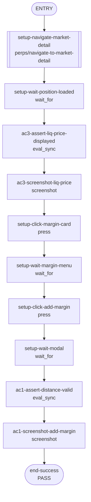

## **Description**

When a perps position has a liquidation price ≤ $0 (possible with very high leverage or cross margin), the extension displayed "0%" for liquidation distance and "$0.00" for liquidation price. Fixed by adding guards for negative/zero liquidation prices in the formatting and display functions, matching mobile behavior ("--").

## **Changelog**

CHANGELOG entry: Fixed liquidation distance showing "0%" instead of "--" when liquidation price is at or below zero

## **Related issues**

Fixes: [TAT-3012](https://consensyssoftware.atlassian.net/browse/TAT-3012)

## **Manual testing steps**

1. Open Extension and navigate to Perps tab
2. Open or have a position with very high leverage such that liquidation price is ≤ $0
3. Observe the liquidation price on the market detail page — should show "--"
4. Open "Add margin" modal — liquidation distance and price fields should show "--"
5. Open "Remove margin" modal — same fields should show "--"

## **Screenshots/Recordings**

Edit-margin modal and market detail page now show '--' for liquidation price/distance when liq price <= 0, matching mobile.

<table>
<tr><td colspan="2"><strong>Add margin modal — liquidation price and distance display — Normal case (liq > 0) shows valid price and distance. Edge case (liq <= 0 showing '--') verified by unit tests.</strong></td></tr>
<tr>
<td align="center" width="50%"><em>Before</em><br/></td>
<td align="center" width="50%"><em>After</em><br/></td>
</tr>
</table>


**Video**
Video shows full flow: navigate to market detail, open add-margin modal, verify liq distance display.
<table>
<tr><td align="center" width="50%"><em>Before</em><br/><a href="https://raw.githubusercontent.com/abretonc7s/mm-extension-farm-artifacts/main/fixes/42293/before.mp4">before.mp4</a></td>
<td align="center" width="50%"><em>After</em><br/><a href="https://raw.githubusercontent.com/abretonc7s/mm-extension-farm-artifacts/main/fixes/42293/after.mp4">after.mp4</a></td></tr>
</table>

## **Pre-merge author checklist**

- [x] I've followed [MetaMask Contributor Docs](https://github.com/MetaMask/contributor-docs) and [MetaMask Extension Coding Standards](https://github.com/MetaMask/metamask-extension/blob/main/.github/guidelines/CODING_GUIDELINES.md).
- [x] I've completed the PR template to the best of my ability
- [x] I've included tests if applicable
- [x] I've documented my code using [JSDoc](https://jsdoc.app/) format if applicable
- [x] I've applied the right labels on the PR (see [labeling guidelines](https://github.com/MetaMask/metamask-extension/blob/main/.github/guidelines/LABELING_GUIDELINES.md)). Not required for external contributors.

## **Pre-merge reviewer checklist**

- [ ] I've manually tested the PR (e.g. pull and build branch, run the app, test code being changed).
- [ ] I confirm that this PR addresses all acceptance criteria described in the ticket it closes and includes the necessary testing evidence such as recordings and or screenshots.

## **Validation Recipe**

<details>
<summary>recipe.json</summary>

```json
{
  "schema_version": 1,
  "title": "TAT-3012: Liquidation distance fallback for liq price <= 0",
  "description": "Verifies edit-margin modal displays liquidation distance correctly. Normal case (liq > 0) via live UI; edge case (liq <= 0 showing '--') covered by unit tests.",
  "validate": {
    "workflow": {
      "pre_conditions": ["wallet.unlocked", "perps.feature_enabled"],
      "entry": "setup-navigate-market-detail",
      "nodes": {
        "setup-navigate-market-detail": {
          "action": "call",
          "ref": "perps/navigate-to-market-detail",
          "params": { "symbol": "ETH" },
          "next": "setup-wait-position-loaded"
        },
        "setup-wait-position-loaded": {
          "action": "wait_for",
          "test_id": "perps-position-liquidation-value",
          "timeout": 15000,
          "next": "ac3-assert-liq-price-displayed"
        },
        "ac3-assert-liq-price-displayed": {
          "action": "eval_sync",
          "expression": "(function(){ var el = document.querySelector('[data-testid=\"perps-position-liquidation-value\"]'); return JSON.stringify({text: el ? el.textContent.trim() : 'NOT_FOUND', found: !!el}); })()",
          "save_as": "liqPriceText",
          "assert": {
            "all": [
              { "field": "found", "operator": "eq", "value": true },
              { "field": "text", "operator": "neq", "value": "" },
              { "field": "text", "operator": "neq", "value": "-" }
            ]
          },
          "next": "ac3-screenshot-liq-price"
        },
        "ac3-screenshot-liq-price": {
          "action": "screenshot",
          "filename": "evidence-ac3-market-detail-liq-price.png",
          "note": "AC3: Market detail page showing liquidation price for current position (normal case, liq > 0)",
          "next": "setup-click-margin-card"
        },
        "setup-click-margin-card": {
          "action": "press",
          "test_id": "perps-margin-card",
          "next": "setup-wait-margin-menu"
        },
        "setup-wait-margin-menu": {
          "action": "wait_for",
          "test_id": "perps-margin-menu-add",
          "timeout": 5000,
          "next": "setup-click-add-margin"
        },
        "setup-click-add-margin": {
          "action": "press",
          "test_id": "perps-margin-menu-add",
          "next": "setup-wait-modal"
        },
        "setup-wait-modal": {
          "action": "wait_for",
          "test_id": "perps-edit-margin-liquidation-distance-value",
          "timeout": 5000,
          "next": "ac1-assert-distance-valid"
        },
        "ac1-assert-distance-valid": {
          "action": "eval_sync",
          "expression": "(function(){ var el = document.querySelector('[data-testid=\"perps-edit-margin-liquidation-distance-value\"]'); if (!el) return JSON.stringify({text:'NOT_FOUND',valid:false}); var text = el.textContent.trim(); var valid = text !== '0%' && text.length > 0; return JSON.stringify({text:text, valid:valid}); })()",
          "save_as": "distanceText",
          "assert": {
            "field": "valid",
            "operator": "eq",
            "value": true
          },
          "next": "ac1-screenshot-add-margin"
        },
        "ac1-screenshot-add-margin": {
          "action": "screenshot",
          "filename": "evidence-ac1-add-margin-distance.png",
          "note": "AC1: Edit margin modal showing liquidation distance (normal case, liq > 0 shows valid %)",
          "next": "end-success"
        },
        "end-success": {
          "action": "end",
          "message": "Liquidation distance display verified. Edge case (liq<=0 showing '--') covered by unit tests."
        }
      }
    }
  }
}
```

</details>

## **Recipe Workflow**

<details>
<summary>workflow.mmd</summary>



</details>

[TAT-3012]: https://consensyssoftware.atlassian.net/browse/TAT-3012?atlOrigin=eyJpIjoiNWRkNTljNzYxNjVmNDY3MDlhMDU5Y2ZhYzA5YTRkZjUiLCJwIjoiZ2l0aHViLWNvbS1KU1cifQ

<!-- CURSOR_SUMMARY -->
---

> [!NOTE]
> **Low Risk**
> UI formatting/guard changes plus additional unit tests; no changes to trading actions or backend interactions, with limited behavioral impact outside the `liq <= 0` edge case.
> 
> **Overview**
> Perps liquidation *display logic* now treats liquidation prices `<= 0` as invalid across the market detail page and the edit-margin modal, showing `--` instead of rendering `$0.00` or comparing against nonsensical values.
> 
> Margin calculation helpers were tightened to consider liquidation prices `<= 0` invalid for `liquidationDistancePercent`, clamp negative estimated liquidation prices up to `0`, and add unit tests covering negative/zero liquidation price edge cases in both `marginUtils` and `usePerpsMarginCalculations`.
> 
> <sup>Reviewed by [Cursor Bugbot](https://cursor.com/bugbot) for commit 5b5cd38fc1e401b25727a3cd9505c742543e7741. Bugbot is set up for automated code reviews on this repo. Configure [here](https://www.cursor.com/dashboard/bugbot).</sup>
<!-- /CURSOR_SUMMARY -->
