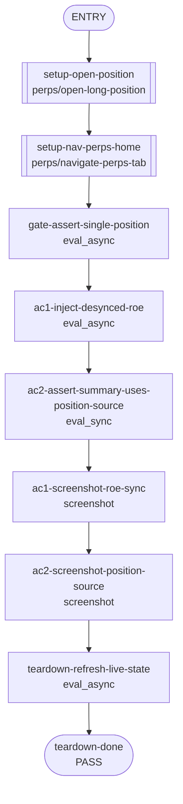

## **Description**

Fixes a Perps home-screen RoE mismatch for accounts with exactly one open position. The unrealized P&L summary row now uses the same single-position RoE value rendered by the position card, while preserving account aggregate RoE behavior for zero or multiple positions.

## **Changelog**

CHANGELOG entry: Fixed a bug where Perps RoE values could differ between the summary row and a single open position card

## **Related issues**

Fixes: [TAT-3015](https://consensyssoftware.atlassian.net/browse/TAT-3015)

## **Manual testing steps**

1. Open MetaMask Extension and unlock the wallet.
2. Navigate to the Perps tab with exactly one open position.
3. Confirm the unrealized P&L summary row RoE matches the position card RoE while the position updates.

## **Screenshots/Recordings**

<table>
<tr><td align="center" width="50%"><strong>Screenshots/evidence Ac1 Roe Sync 1777597416460</strong><br/></td><td align="center" width="50%"><strong>Screenshots/evidence Ac2 Position Source 1777597416547</strong><br/></td></tr>
<tr><td align="center" width="50%"><strong>Screenshots/long Position ETH 1777597415853</strong><br/><br/><sub>caption confidence: LOW — generic filename — no state-specific suffix</sub></td><td align="center" width="50%"><strong>Screenshots/perps Tab 1777597416345</strong><br/><br/><sub>caption confidence: LOW — generic filename — no state-specific suffix</sub></td></tr>
</table>

## **Pre-merge author checklist**

- [x] I've followed [MetaMask Contributor Docs](https://github.com/MetaMask/contributor-docs) and [MetaMask Extension Coding Standards](https://github.com/MetaMask/metamask-extension/blob/main/.github/guidelines/CODING_GUIDELINES.md).
- [x] I've completed the PR template to the best of my ability
- [x] I’ve included tests if applicable
- [x] I’ve documented my code using [JSDoc](https://jsdoc.app/) format if applicable
- [x] I’ve applied the right labels on the PR (see [labeling guidelines](https://github.com/MetaMask/metamask-extension/blob/main/.github/guidelines/LABELING_GUIDELINES.md)). Not required for external contributors.

## **Pre-merge reviewer checklist**

- [ ] I've manually tested the PR (e.g. pull and build branch, run the app, test code being changed).
- [ ] I confirm that this PR addresses all acceptance criteria described in the ticket it closes and includes the necessary testing evidence such as recordings and or screenshots.

## **Validation Recipe**

<details>
<summary>recipe.json</summary>

```json
{
  "title": "TAT-3015 — Perps single-position summary RoE matches position card",
  "description": "Validates that the Perps home unrealized P&L summary RoE follows the single open position stream and stays aligned with the position card RoE.",
  "schema_version": 1,
  "validate": {
    "workflow": {
      "pre_conditions": [
        "wallet.unlocked",
        "perps.feature_enabled",
        "perps.ready_to_trade",
        "perps.sufficient_balance"
      ],
      "entry": "setup-open-position",
      "nodes": {
        "setup-open-position": {
          "action": "call",
          "ref": "perps/open-long-position",
          "params": {
            "symbol": "ETH",
            "side": "long",
            "amount": "10"
          },
          "next": "setup-nav-perps-home"
        },
        "setup-nav-perps-home": {
          "action": "call",
          "ref": "perps/navigate-perps-tab",
          "next": "gate-assert-single-position"
        },
        "gate-assert-single-position": {
          "action": "eval_async",
          "expression": "(async()=>{var positions=await stateHooks.submitRequestToBackground('perpsGetPositions',[]);positions=positions||[];return JSON.stringify({count:positions.length,symbols:positions.map(function(p){return p.symbol})})})()",
          "assert": {
            "operator": "eq",
            "field": "count",
            "value": 1
          },
          "next": "ac1-inject-desynced-roe"
        },
        "ac1-inject-desynced-roe": {
          "action": "eval_async",
          "expression": "(async()=>{var sm=stateHooks.getPerpsStreamManager();var positions=sm.positions.getCachedData()||[];var base=positions[0];if(!base){return JSON.stringify({ok:false,reason:'missing position cache',matches:false})}var freshPosition=Object.assign({},base,{unrealizedPnl:'4.20',marginUsed:'10',positionValue:'14.20',returnOnEquity:'0.42'});var account=sm.account.getCachedData()||{};sm.account.pushData(Object.assign({},account,{unrealizedPnl:'1.00',returnOnEquity:'1'}));sm.positions.pushData([freshPosition]);window.__tat3015RoeProbe={staleAccountRoe:'1.00%',positionRoe:'42.00%'};await new Promise(requestAnimationFrame);await new Promise(requestAnimationFrame);var summary=document.querySelector('[data-testid=\"perps-balance-dropdown-pnl\"]')?.textContent?.replace(/\\s+/g,' ').trim()||'';var card=document.querySelector('[data-testid^=\"position-card-roe-\"]')?.textContent?.replace(/\\s+/g,' ').trim()||'';var summaryMatch=summary.match(/\\(([^)]+%)\\)/);var summaryRoe=summaryMatch?summaryMatch[1]:'';var cardRoe=card.replace(/[()]/g,'');return JSON.stringify({ok:true,summaryRoe:summaryRoe,cardRoe:cardRoe,matches:summaryRoe===cardRoe,summary:summary,card:card,positionReturnOnEquity:freshPosition.returnOnEquity,accountReturnOnEquity:'1'})})()",
          "assert": {
            "operator": "eq",
            "field": "matches",
            "value": true
          },
          "next": "ac2-assert-summary-uses-position-source"
        },
        "ac2-assert-summary-uses-position-source": {
          "action": "eval_sync",
          "expression": "(function(){var summary=document.querySelector('[data-testid=\"perps-balance-dropdown-pnl\"]')?.textContent?.replace(/\\s+/g,' ').trim()||'';var card=document.querySelector('[data-testid^=\"position-card-roe-\"]')?.textContent?.replace(/\\s+/g,' ').trim()||'';var summaryMatch=summary.match(/\\(([^)]+%)\\)/);var summaryRoe=summaryMatch?summaryMatch[1]:'';var cardRoe=card.replace(/[()]/g,'');var probe=window.__tat3015RoeProbe||{};return JSON.stringify({summaryRoe:summaryRoe,cardRoe:cardRoe,staleAccountRoe:probe.staleAccountRoe||'',usesPositionSource:summaryRoe===cardRoe&&summaryRoe!==probe.staleAccountRoe,summary:summary,card:card})})()",
          "assert": {
            "operator": "eq",
            "field": "usesPositionSource",
            "value": true
          },
          "next": "ac1-screenshot-roe-sync"
        },
        "ac1-screenshot-roe-sync": {
          "action": "screenshot",
          "filename": "evidence-ac1-roe-sync",
          "note": "AC1: the unrealized P&L summary row RoE matches the individual ETH position card RoE with one open position.",
          "next": "ac2-screenshot-position-source"
        },
        "ac2-screenshot-position-source": {
          "action": "screenshot",
          "filename": "evidence-ac2-position-source",
          "note": "AC2: after a fresh position stream update and stale account RoE cache, the summary row still displays the same RoE as the position card.",
          "next": "teardown-refresh-live-state"
        },
        "teardown-refresh-live-state": {
          "action": "eval_async",
          "expression": "(async()=>{var sm=stateHooks.getPerpsStreamManager();var positions=await stateHooks.submitRequestToBackground('perpsGetPositions',[]);var account=await stateHooks.submitRequestToBackground('perpsGetAccountState',[]);sm.positions.pushData(positions||[]);sm.account.pushData(account||null);delete window.__tat3015RoeProbe;return JSON.stringify({ok:true,positions:(positions||[]).length})})()",
          "assert": {
            "operator": "eq",
            "field": "ok",
            "value": true
          },
          "next": "teardown-done"
        },
        "teardown-done": {
          "action": "end",
          "status": "pass",
          "message": "TAT-3015 RoE sync validation passed"
        }
      }
    }
  }
}
```
</details>

## **Recipe Workflow**

<details>
<summary>workflow.mmd</summary>


</details>

[TAT-3015]: https://consensyssoftware.atlassian.net/browse/TAT-3015?atlOrigin=eyJpIjoiNWRkNTljNzYxNjVmNDY3MDlhMDU5Y2ZhYzA5YTRkZjUiLCJwIjoiZ2l0aHViLWNvbS1KU1cifQ

<!-- CURSOR_SUMMARY -->
---

> [!NOTE]
> **Low Risk**
> Low risk UI logic change that only affects how RoE is sourced/displayed in the Perps balance header; no trading actions, auth, or persistence paths are modified.
> 
> **Overview**
> Fixes a Perps home-screen RoE mismatch by allowing `PerpsBalanceDropdown` to accept an optional `singlePosition` and, when present, render its `returnOnEquity` in the unrealized P&L summary instead of the account aggregate.
> 
> `PerpsView` now passes through the lone open position when `positions.length === 1`, and tests were added/updated to assert single-position RoE stays aligned with the position card while multi-position summaries continue using the account-level RoE.
> 
> <sup>Reviewed by [Cursor Bugbot](https://cursor.com/bugbot) for commit 884fd9efddc0534424a8ddb6d4731e5865369632. Bugbot is set up for automated code reviews on this repo. Configure [here](https://www.cursor.com/dashboard/bugbot).</sup>
<!-- /CURSOR_SUMMARY -->

