<!--
Please submit this PR as a draft initially.
Do not mark it as "Ready for review" until the template has been completely filled out, and PR status checks have passed at least once.
-->

## **Description**

In the Perps tab on wallet home and on every perps market detail page, the Recent Activity section only made the section-header `>` chevron tappable. Each transaction row was rendered as a non-interactive container, so users tapping on a row got no response.

`TransactionCard` only renders an interactive `ButtonBase` when an `onClick` prop is supplied. `PerpsRecentActivity` (mounted from `perps-view`) was instantiated without `onTransactionClick`, and `PerpsMarketRecentActivity` never wired `onClick` at all — the rows fell through to a plain `<Box>`.

Fix: default the row tap on both surfaces to `navigate(PERPS_ACTIVITY_ROUTE)` (same destination as the existing See All chevron) when no caller-supplied handler is provided. This mirrors mobile's `PerpsRecentActivityList` where every row is wrapped in a `TouchableOpacity onPress`.

## **Changelog**

CHANGELOG entry: Fixed an issue where Recent Activity rows on the Perps tab and market detail page were not tappable; tapping a row now opens the full activity list.

## **Related issues**

Fixes: [TAT-3077](https://consensyssoftware.atlassian.net/browse/TAT-3077)

## **Manual testing steps**

1. Open the extension and switch to the Perps tab on wallet home.
2. Scroll to the "Recent activity" section.
3. Tap on any transaction row (anywhere on the row, not just the `>`).
4. Confirm the app navigates to the perps Activity page (`/perps/activity`).
5. Go back, then open any market detail (e.g. BTC-USD) from the watchlist or explore section.
6. Scroll to the "Recent activity" section on the market detail page.
7. Tap on any transaction row.
8. Confirm the app navigates to the perps Activity page (`/perps/activity`).

## **Screenshots/Recordings**

<!-- The gateway will replace this section using evidence-manifest.json + uploaded artifact URLs. -->

### **Before**

<!-- [screenshots/recordings] -->

### **After**

<!-- [screenshots/recordings] -->

## **Pre-merge author checklist**

- [x] I've followed [MetaMask Contributor Docs](https://github.com/MetaMask/contributor-docs) and [MetaMask Extension Coding Standards](https://github.com/MetaMask/metamask-extension/blob/main/.github/guidelines/CODING_GUIDELINES.md).
- [x] I've completed the PR template to the best of my ability
- [x] I’ve included tests if applicable
- [x] I’ve documented my code using [JSDoc](https://jsdoc.app/) format if applicable
- [x] I’ve applied the right labels on the PR (see [labeling guidelines](https://github.com/MetaMask/metamask-extension/blob/main/.github/guidelines/LABELING_GUIDELINES.md)). Not required for external contributors.

## **Pre-merge reviewer checklist**

- [ ] I've manually tested the PR (e.g. pull and build branch, run the app, test code being changed).
- [ ] I confirm that this PR addresses all acceptance criteria described in the ticket it closes and includes the necessary testing evidence such as recordings and or screenshots.

## **Validation Recipe**

<details>
<summary>recipe.json — runs via <code>node temp/recipes/validate-recipe.js --recipe artifacts/recipe.json --cdp-port &lt;port&gt; --skip-manual</code></summary>

```json
{
  "title": "TAT-3077 — Recent activity row fully tappable on perps tab and market detail",
  "schema_version": 1,
  "initial_conditions": {
    "account": "0x316BDE155acd07609872a56Bc32CcfB0B13201fA"
  },
  "validate": {
    "workflow": {
      "pre_conditions": ["wallet.unlocked", "perps.feature_enabled"],
      "entry": "setup-call-navigate-perps",
      "nodes": {
        "setup-call-navigate-perps": {
          "action": "call",
          "ref": "perps/navigate-perps-tab",
          "next": "setup-wait-recent-activity-home"
        },
        "setup-wait-recent-activity-home": {
          "action": "wait_for",
          "test_id": "perps-recent-activity",
          "timeout_ms": 15000,
          "next": "ac1-find-first-row"
        },
        "ac1-find-first-row": {
          "action": "eval_sync",
          "expression": "(()=>{var c=document.querySelector('[data-testid=\"perps-recent-activity\"]');var rows=c?Array.from(c.querySelectorAll('[data-testid^=\"transaction-card-\"]')):[];var first=rows[0];return JSON.stringify({count:rows.length,id:first?first.getAttribute('data-testid'):'',tag:first?first.tagName.toLowerCase():'',symbol:'BTC'});})()",
          "save_as": "ac1_row",
          "assert": { "operator": "gte", "field": "count", "value": 1 },
          "next": "ac1-scroll-row"
        },
        "ac1-scroll-row": {
          "action": "scroll",
          "test_id": "{{vars.ac1_row.id}}",
          "next": "ac1-screenshot-before-tap"
        },
        "ac1-screenshot-before-tap": {
          "action": "screenshot",
          "filename": "evidence-ac1-row-before-tap",
          "note": "AC1: recent-activity row visible on perps tab before tap",
          "next": "ac1-tap-row"
        },
        "ac1-tap-row": {
          "action": "press",
          "test_id": "{{vars.ac1_row.id}}",
          "next": "ac1-wait-activity-page"
        },
        "ac1-wait-activity-page": {
          "action": "wait_for",
          "test_id": "perps-activity-page",
          "timeout_ms": 5000,
          "next": "ac1-assert-route"
        },
        "ac1-assert-route": {
          "action": "eval_sync",
          "expression": "JSON.stringify({hash:location.hash,onActivityPage:!!document.querySelector('[data-testid=\"perps-activity-page\"]')})",
          "assert": {
            "all": [
              { "operator": "contains", "field": "hash", "value": "/perps/activity" },
              { "operator": "eq", "field": "onActivityPage", "value": true }
            ]
          },
          "next": "ac1-screenshot-activity-page"
        },
        "ac1-screenshot-activity-page": {
          "action": "screenshot",
          "filename": "evidence-ac1-activity-page",
          "note": "AC1: tap on recent activity row navigated to /perps/activity",
          "next": "ac2-back-to-perps"
        },
        "ac2-back-to-perps": {
          "action": "ext_navigate_hash",
          "hash": "/?tab=perps",
          "next": "ac2-wait-perps-tab"
        },
        "ac2-wait-perps-tab": {
          "action": "wait_for",
          "test_id": "perps-balance-dropdown",
          "timeout_ms": 10000,
          "next": "ac2-pick-symbol"
        },
        "ac2-pick-symbol": {
          "action": "eval_async",
          "expression": "(async()=>{var fills=await stateHooks.submitRequestToBackground('perpsGetOrderFills',[]);var arr=Array.isArray(fills)?fills:[];var counts={};for(var i=0;i<arr.length;i++){var s=arr[i]&&arr[i].symbol;if(s){counts[s]=(counts[s]||0)+1;}}var top=Object.keys(counts).sort(function(a,b){return counts[b]-counts[a];})[0];return JSON.stringify({fillCount:arr.length,symbol:top||'BTC',counts:counts});})()",
          "save_as": "ac2_market",
          "assert": { "operator": "gte", "field": "fillCount", "value": 1 },
          "next": "ac2-call-navigate-market-detail"
        },
        "ac2-call-navigate-market-detail": {
          "action": "call",
          "ref": "perps/navigate-to-market-detail",
          "params": { "symbol": "{{vars.ac2_market.symbol}}" },
          "next": "ac2-warm-market-fills"
        },
        "ac2-warm-market-fills": {
          "action": "eval_async",
          "expression": "(async()=>{var sym='{{vars.ac2_market.symbol}}';var fills=await stateHooks.submitRequestToBackground('perpsGetOrderFills',[]);var arr=Array.isArray(fills)?fills:[];var matching=arr.filter(function(f){return f&&f.symbol===sym;});return JSON.stringify({symbol:sym,matchingForSymbol:matching.length});})()",
          "save_as": "ac2_market_fills",
          "assert": { "operator": "gte", "field": "matchingForSymbol", "value": 1 },
          "next": "ac2-wait-market-recent-activity"
        },
        "ac2-wait-market-recent-activity": {
          "action": "wait_for",
          "expression": "JSON.stringify({ok:Array.from(document.querySelectorAll('[data-testid^=\"transaction-card-\"]')).length > 0})",
          "assert": { "operator": "eq", "field": "ok", "value": true },
          "timeout_ms": 20000,
          "next": "ac2-find-first-row"
        },
        "ac2-find-first-row": {
          "action": "eval_sync",
          "expression": "(()=>{var rows=Array.from(document.querySelectorAll('[data-testid^=\"transaction-card-\"]'));var first=rows[0];return JSON.stringify({count:rows.length,id:first?first.getAttribute('data-testid'):'',tag:first?first.tagName.toLowerCase():'',hash:location.hash});})()",
          "save_as": "ac2_row",
          "assert": {
            "all": [
              { "operator": "gte", "field": "count", "value": 1 },
              { "operator": "contains", "field": "hash", "value": "/perps/market/" }
            ]
          },
          "next": "ac2-scroll-row"
        },
        "ac2-scroll-row": {
          "action": "scroll",
          "test_id": "{{vars.ac2_row.id}}",
          "next": "ac2-screenshot-before-tap"
        },
        "ac2-screenshot-before-tap": {
          "action": "screenshot",
          "filename": "evidence-ac2-row-before-tap",
          "note": "AC2: recent-activity row visible on market detail before tap",
          "next": "ac2-tap-row"
        },
        "ac2-tap-row": {
          "action": "press",
          "test_id": "{{vars.ac2_row.id}}",
          "next": "ac2-wait-activity-page"
        },
        "ac2-wait-activity-page": {
          "action": "wait_for",
          "test_id": "perps-activity-page",
          "timeout_ms": 5000,
          "next": "ac2-assert-route"
        },
        "ac2-assert-route": {
          "action": "eval_sync",
          "expression": "JSON.stringify({hash:location.hash,onActivityPage:!!document.querySelector('[data-testid=\"perps-activity-page\"]')})",
          "assert": {
            "all": [
              { "operator": "contains", "field": "hash", "value": "/perps/activity" },
              { "operator": "eq", "field": "onActivityPage", "value": true }
            ]
          },
          "next": "ac2-screenshot-activity-page"
        },
        "ac2-screenshot-activity-page": {
          "action": "screenshot",
          "filename": "evidence-ac2-activity-page",
          "note": "AC2: tap on market-detail recent-activity row navigated to /perps/activity",
          "next": "done"
        },
        "done": { "action": "end", "status": "pass" }
      }
    }
  }
}
```

</details>

## **Recipe Workflow**

```mermaid
flowchart TD
  %% TAT-3077 — Recent activity row fully tappable on perps tab and market detail
  __entry__(["ENTRY"]) --> node_setup_call_navigate_perps
  node_setup_call_navigate_perps[["setup-call-navigate-perps<br/>perps/navigate-perps-tab"]]
  node_setup_wait_recent_activity_home["setup-wait-recent-activity-home<br/>wait_for"]
  node_ac1_find_first_row["ac1-find-first-row<br/>eval_sync"]
  node_ac1_scroll_row["ac1-scroll-row<br/>scroll"]
  node_ac1_screenshot_before_tap["ac1-screenshot-before-tap<br/>screenshot"]
  node_ac1_tap_row["ac1-tap-row<br/>press"]
  node_ac1_wait_activity_page["ac1-wait-activity-page<br/>wait_for"]
  node_ac1_assert_route["ac1-assert-route<br/>eval_sync"]
  node_ac1_screenshot_activity_page["ac1-screenshot-activity-page<br/>screenshot"]
  node_ac2_back_to_perps["ac2-back-to-perps<br/>ext_navigate_hash"]
  node_ac2_wait_perps_tab["ac2-wait-perps-tab<br/>wait_for"]
  node_ac2_pick_symbol["ac2-pick-symbol<br/>eval_async"]
  node_ac2_call_navigate_market_detail[["ac2-call-navigate-market-detail<br/>perps/navigate-to-market-detail"]]
  node_ac2_warm_market_fills["ac2-warm-market-fills<br/>eval_async"]
  node_ac2_wait_market_recent_activity["ac2-wait-market-recent-activity<br/>wait_for"]
  node_ac2_find_first_row["ac2-find-first-row<br/>eval_sync"]
  node_ac2_scroll_row["ac2-scroll-row<br/>scroll"]
  node_ac2_screenshot_before_tap["ac2-screenshot-before-tap<br/>screenshot"]
  node_ac2_tap_row["ac2-tap-row<br/>press"]
  node_ac2_wait_activity_page["ac2-wait-activity-page<br/>wait_for"]
  node_ac2_assert_route["ac2-assert-route<br/>eval_sync"]
  node_ac2_screenshot_activity_page["ac2-screenshot-activity-page<br/>screenshot"]
  node_done(["done<br/>PASS"])
  node_setup_call_navigate_perps --> node_setup_wait_recent_activity_home
  node_setup_wait_recent_activity_home --> node_ac1_find_first_row
  node_ac1_find_first_row --> node_ac1_scroll_row
  node_ac1_scroll_row --> node_ac1_screenshot_before_tap
  node_ac1_screenshot_before_tap --> node_ac1_tap_row
  node_ac1_tap_row --> node_ac1_wait_activity_page
  node_ac1_wait_activity_page --> node_ac1_assert_route
  node_ac1_assert_route --> node_ac1_screenshot_activity_page
  node_ac1_screenshot_activity_page --> node_ac2_back_to_perps
  node_ac2_back_to_perps --> node_ac2_wait_perps_tab
  node_ac2_wait_perps_tab --> node_ac2_pick_symbol
  node_ac2_pick_symbol --> node_ac2_call_navigate_market_detail
  node_ac2_call_navigate_market_detail --> node_ac2_warm_market_fills
  node_ac2_warm_market_fills --> node_ac2_wait_market_recent_activity
  node_ac2_wait_market_recent_activity --> node_ac2_find_first_row
  node_ac2_find_first_row --> node_ac2_scroll_row
  node_ac2_scroll_row --> node_ac2_screenshot_before_tap
  node_ac2_screenshot_before_tap --> node_ac2_tap_row
  node_ac2_tap_row --> node_ac2_wait_activity_page
  node_ac2_wait_activity_page --> node_ac2_assert_route
  node_ac2_assert_route --> node_ac2_screenshot_activity_page
  node_ac2_screenshot_activity_page --> node_done
```

<details>
<summary>workflow.mmd</summary>



</details>
