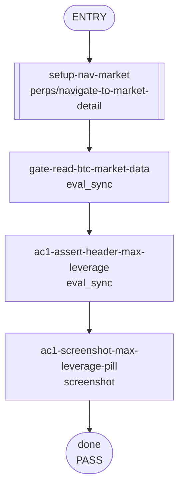

<!--
Please submit this PR as a draft initially.
Do not mark it as "Ready for review" until the template has been completely filled out, and PR status checks have passed at least once.
-->

## **Description**

Adds the market max leverage pill to the perps market detail header. The page already receives `market.maxLeverage`; this renders it next to the market title to match the mobile market detail behavior.

## **Changelog**

CHANGELOG entry: Fixed a bug that hid max leverage on the perps market detail page

## **Related issues**

Fixes: [TAT-3104](https://consensyssoftware.atlassian.net/browse/TAT-3104)

## **Manual testing steps**

1. Unlock the wallet.
2. Open Perps and navigate to the BTC market detail page.
3. Confirm the market detail header shows BTC-USD with a max leverage pill, for example 40x.

## **Screenshots/Recordings**

Evidence will be attached by the gateway from the evidence manifest.

### **Before**

<!-- Gateway will insert before evidence. -->

### **After**

<!-- Gateway will insert after evidence. -->

## **Pre-merge author checklist**

- [x] I've followed [MetaMask Contributor Docs](https://github.com/MetaMask/contributor-docs) and [MetaMask Extension Coding Standards](https://github.com/MetaMask/metamask-extension/blob/main/.github/guidelines/CODING_GUIDELINES.md).
- [x] I've completed the PR template to the best of my ability
- [x] I’ve included tests if applicable
- [x] I’ve documented my code using [JSDoc](https://jsdoc.app/) format if applicable
- [x] I’ve applied the right labels on the PR (see [labeling guidelines](https://github.com/MetaMask/metamask-extension/blob/main/.github/guidelines/LABELING_GUIDELINES.md)). Not required for external contributors.

## **Pre-merge reviewer checklist**

- [ ] I've manually tested the PR (e.g. pull and build branch, run the app, test code being changed).
- [ ] I confirm that this PR addresses all acceptance criteria described in the ticket it closes and includes the necessary testing evidence such as recordings and or screenshots.

## **Validation Recipe**

<details>
<summary>recipe.json</summary>

```json
{
  "title": "TAT-3104 market detail max leverage pill",
  "schema_version": 1,
  "description": "Validates that the perps BTC market detail header renders the market max leverage pill from live market metadata.",
  "validate": {
    "workflow": {
      "pre_conditions": ["wallet.unlocked"],
      "entry": "setup-nav-market",
      "nodes": {
        "setup-nav-market": {
          "action": "call",
          "ref": "perps/navigate-to-market-detail",
          "params": { "symbol": "BTC" },
          "next": "gate-read-btc-market-data"
        },
        "gate-read-btc-market-data": {
          "action": "eval_sync",
          "expression": "(function(){var sm=stateHooks.getPerpsStreamManager&&stateHooks.getPerpsStreamManager();var rows=sm?.markets?.getCachedData?.()||[];var btc=rows.find(function(m){return m.symbol==='BTC';});return JSON.stringify({hasBtc:!!btc,maxLeverage:btc&&btc.maxLeverage||null});})()",
          "assert": {
            "all": [
              { "operator": "eq", "field": "hasBtc", "value": true },
              { "operator": "eq", "field": "maxLeverage", "value": "40x" }
            ]
          },
          "save_as": "btc_market",
          "next": "ac1-assert-header-max-leverage"
        },
        "ac1-assert-header-max-leverage": {
          "action": "eval_sync",
          "expression": "(function(){var page=!!document.querySelector('[data-testid=\"perps-market-detail-page\"]');var pill=document.querySelector('[data-testid=\"perps-market-max-leverage\"]');var pillText=pill?.textContent?.trim()||null;var header=document.querySelector('[data-testid=\"perps-market-detail-page\"]')?.innerText||'';return JSON.stringify({page:page,pillText:pillText,headerIncludesPill:header.includes('40x'),hash:location.hash});})()",
          "assert": {
            "all": [
              { "operator": "eq", "field": "page", "value": true },
              { "operator": "eq", "field": "pillText", "value": "40x" },
              { "operator": "eq", "field": "headerIncludesPill", "value": true }
            ]
          },
          "save_as": "header_pill",
          "next": "ac1-screenshot-max-leverage-pill"
        },
        "ac1-screenshot-max-leverage-pill": {
          "action": "screenshot",
          "filename": "evidence-ac1-max-leverage-pill.png",
          "note": "AC1: BTC market detail header visibly shows the 40x max leverage pill",
          "next": "done"
        },
        "done": { "action": "end", "status": "pass" }
      }
    }
  }
}

```

</details>

## **Recipe Workflow**

<details>
<summary>workflow.mmd</summary>



</details>
