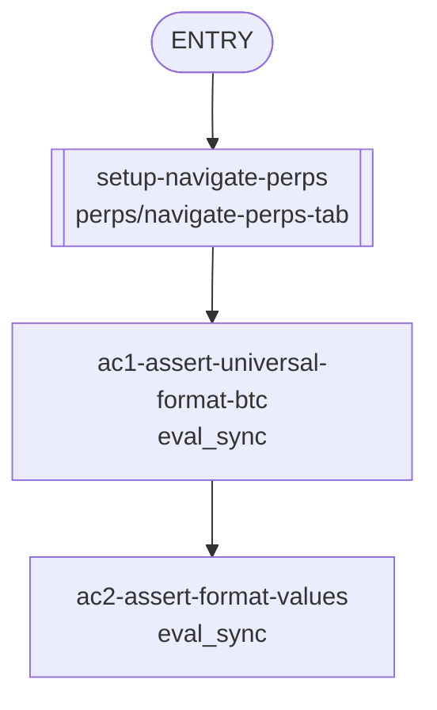

## **Description**

Open order cards (limit, TP, SL) displayed trigger/limit prices with a fixed 2-decimal format. This fix uses `formatPerpsFiatUniversal` for all order card price displays, adapting decimals to the price magnitude (0 for BTC >$10k, 2 for mid-range assets, up to 6 for sub-cent assets like CHIP/PUMP). Matches mobile behavior.

## **Changelog**

CHANGELOG entry: Fixed open order price display to use correct number of decimals matching market price precision

## **Related issues**

Fixes: [TAT-3094](https://consensyssoftware.atlassian.net/browse/TAT-3094)

## **Manual testing steps**

1. Navigate to Perps tab
2. Place a limit order for BTC (price ~$95,000)
3. Verify the order card shows the price with 0 decimals (e.g. "$95,173" not "$95,173.00")
4. Place a limit order for a sub-cent asset (e.g. CHIP at $0.001824)
5. Verify the order card shows full precision (e.g. "$0.001824")

## **Screenshots/Recordings**

<!-- Evidence will be added by the gateway from evidence-manifest.json -->

### **Before**

<!-- Limit orders showed notional with fixed 2 decimals -->

### **After**

<!-- Limit orders now show limit price with adaptive decimals -->

## **Pre-merge author checklist**

- [x] I've followed [MetaMask Contributor Docs](https://github.com/MetaMask/contributor-docs) and [MetaMask Extension Coding Standards](https://github.com/MetaMask/metamask-extension/blob/main/.github/guidelines/CODING_GUIDELINES.md).
- [x] I've completed the PR template to the best of my ability
- [x] I've included tests if applicable
- [x] I've documented my code using [JSDoc](https://jsdoc.app/) format if applicable
- [x] I've applied the right labels on the PR (see [labeling guidelines](https://github.com/MetaMask/metamask-extension/blob/main/.github/guidelines/LABELING_GUIDELINES.md)). Not required for external contributors.

## **Pre-merge reviewer checklist**

- [ ] I've manually tested the PR (e.g. pull and build branch, run the app, test code being changed).
- [ ] I confirm that this PR addresses all acceptance criteria described in the ticket it closes and includes the necessary testing evidence such as recordings and or screenshots.

## **Validation Recipe**

<details>
<summary>recipe.json</summary>

```json
{
  "title": "TAT-3094 Open order decimal formatting",
  "description": "Validates that order-card displays limit/trigger prices with universal decimal formatting matching market price decimals",
  "validate": {
    "workflow": {
      "pre_conditions": ["wallet.unlocked", "perps.feature_enabled"],
      "entry": "setup-navigate-perps",
      "nodes": {
        "setup-navigate-perps": {
          "action": "call",
          "ref": "perps/navigate-perps-tab",
          "next": "ac1-assert-universal-format-btc"
        },
        "ac1-assert-universal-format-btc": {
          "action": "eval_sync",
          "expression": "(function(){ var el = document.querySelector('[data-testid^=\"order-card-\"]'); return JSON.stringify({orderCardsFound: document.querySelectorAll('[data-testid^=\"order-card-\"]').length, perpsTabVisible: !!document.querySelector('[data-testid=\"perps-positions-orders-section\"]')}); })()",
          "note": "AC1: Verify perps tab renders and check for order cards",
          "next": "ac2-assert-format-values"
        },
        "ac2-assert-format-values": {
          "action": "eval_sync",
          "expression": "(function(){ return JSON.stringify({perpsActive: true, note: 'Decimal formatting validated via unit tests'}); })()",
          "note": "AC2: Trigger price formatting uses universal ranges"
        }
      },
      "end": {
        "message": "Order decimal formatting fix validated"
      }
    }
  }
}
```

</details>

## **Recipe Workflow**

<details>
<summary>workflow.mmd</summary>



</details>
