written, 15185 bytes, replacements=1
 initially.
Do not mark it as "Ready for review" until the template has been completely filled out, and PR status checks have passed at least once.
-->

## **Description**

Fixes Perps liquidation displays so liquidation prices at or below zero render as `--` instead of formatted negative fiat or misleading `0%` distance. The shared liquidation formatter now treats only strictly positive finite values as displayable, and the add-margin calculations no longer anchor distance estimates on non-positive liquidation prices.

## **Changelog**

CHANGELOG entry: Fixed a bug that caused Perps liquidation price and distance to show misleading values for non-positive liquidation prices

## **Related issues**

Fixes: [TAT-3012](https://consensyssoftware.atlassian.net/browse/TAT-3012)

## **Manual testing steps**

1. Open the Extension and navigate to the Perps tab.
2. Open a position whose liquidation price is zero or negative.
3. Confirm the market detail position liquidation field displays `--`.
4. Open Add margin for the same position.
5. Confirm the liquidation price and liquidation distance both display `--`.

## **Screenshots/Recordings**

<table>
<tr><td align="center" width="50%"><strong>Screenshots/evidence Ac1 Position Liq Fallback 1778067150420</strong><br/></td><td align="center" width="50%"><strong>Screenshots/evidence Ac2 Add Margin Liq Fallback 1778067150942</strong><br/></td></tr>
<tr><td align="center" width="50%"><strong>Screenshots/perps Tab 1778067149852</strong><br/><br/><sub>caption confidence: LOW — generic filename — no state-specific suffix</sub></td><td></td></tr>
</table>

## **Pre-merge author checklist**

- [x] I've followed [MetaMask Contributor Docs](https://github.com/MetaMask/contributor-docs) and [MetaMask Extension Coding Standards](https://github.com/MetaMask/metamask-extension/blob/main/.github/guidelines/CODING_GUIDELINES.md).
- [x] I've completed the PR template to the best of my ability
- [x] I’ve included tests if applicable
- [x] I’ve documented my code using [JSDoc](https://jsdoc.app/) format if applicable
- [x] I’ve applied the right labels on the PR (see [labeling guidelines](https://github.com/MetaMask/metamask-extension/blob/main/.github/guidelines/LABELING_GUIDELINES.md)). Not required for external contributors.

## **Pre-merge reviewer checklist**

- [ ] I've manually tested the PR (e.g. pull and build branch, run the app, test code being changed).
- [ ] I confirm that this PR addresses all acceptance criteria described in the ticket it closes and includes the necessary testing evidence such as recordings and or screenshots.

## **Validation Recipe**

<details>
<summary>recipe.json</summary>

```json
{
  "title": "TAT-3012 non-positive liquidation fallback",
  "schema_version": 1,
  "validate": {
    "workflow": {
      "pre_conditions": ["wallet.unlocked", "perps.feature_enabled"],
      "entry": "setup-nav-perps",
      "nodes": {
        "setup-nav-perps": {
          "action": "call",
          "ref": "perps/navigate-perps-tab",
          "next": "setup-inject-cross-position"
        },
        "setup-inject-cross-position": {
          "action": "eval_async",
          "expression": "(async()=>{const sm=stateHooks.getPerpsStreamManager();const positions=await stateHooks.submitRequestToBackground('perpsGetPositions',[]);const base=(positions&&positions.length?positions:[{symbol:'BTC',size:'0.00013',entryPrice:'80000',positionValue:'10',unrealizedPnl:'0',marginUsed:'3',leverage:{type:'cross',value:40},liquidationPrice:'-1',maxLeverage:40,returnOnEquity:'0',cumulativeFunding:{allTime:'0',sinceOpen:'0',sinceChange:'0'},takeProfitCount:0,stopLossCount:0}]);const next=base.map((pos,i)=>i===0?{...pos,symbol:'BTC',liquidationPrice:'-1',leverage:{...(pos.leverage||{}),type:'cross'}}:pos);sm.positions.pushData(next);return JSON.stringify({symbol:next[0].symbol,liquidationPrice:next[0].liquidationPrice,marginType:next[0].leverage.type});})()",
          "assert": { "operator": "eq", "field": "marginType", "value": "cross" },
          "save_as": "cross_position",
          "next": "setup-open-btc-detail"
        },
        "setup-open-btc-detail": {
          "action": "press",
          "test_id": "position-card-BTC",
          "next": "setup-wait-btc-detail"
        },
        "setup-wait-btc-detail": {
          "action": "wait_for",
          "test_id": "perps-market-detail-page",
          "timeout_ms": 10000,
          "next": "ac1-assert-position-liq-fallback"
        },
        "ac1-assert-position-liq-fallback": {
          "action": "eval_sync",
          "expression": "JSON.stringify((()=>{const text=document.querySelector('[data-testid=\"perps-position-liquidation-value\"]')?.innerText?.trim()||'';return {ok:text==='--',text};})())",
          "assert": { "operator": "eq", "field": "ok", "value": true },
          "save_as": "position_liq_fallback",
          "next": "ac1-scroll-position-liq-fallback"
        },
        "ac1-scroll-position-liq-fallback": {
          "action": "scroll",
          "test_id": "perps-position-liquidation-value",
          "next": "ac1-screenshot-position-liq-fallback"
        },
        "ac1-screenshot-position-liq-fallback": {
          "action": "screenshot",
          "filename": "evidence-ac1-position-liq-fallback",
          "note": "AC1: position details liquidation price displays -- for a non-positive cross-margin liquidation price",
          "next": "ac3-assert-cross-liq-fallback"
        },
        "ac3-assert-cross-liq-fallback": {
          "action": "eval_sync",
          "expression": "JSON.stringify({ok:'{{vars.cross_position.marginType}}'==='cross'&&'{{vars.cross_position.liquidationPrice}}'==='-1'&&'{{vars.position_liq_fallback.text}}'==='--',marginType:'{{vars.cross_position.marginType}}',liquidationPrice:'{{vars.cross_position.liquidationPrice}}',display:'{{vars.position_liq_fallback.text}}'})",
          "assert": { "operator": "eq", "field": "ok", "value": true },
          "save_as": "cross_liq_fallback",
          "next": "setup-inject-isolated-position"
        },
        "setup-inject-isolated-position": {
          "action": "eval_async",
          "expression": "(async()=>{const sm=stateHooks.getPerpsStreamManager();const positions=await stateHooks.submitRequestToBackground('perpsGetPositions',[]);const base=(positions&&positions.length?positions:[{symbol:'BTC',size:'0.00013',entryPrice:'80000',positionValue:'10',unrealizedPnl:'0',marginUsed:'3',leverage:{type:'isolated',value:40},liquidationPrice:'-1',maxLeverage:40,returnOnEquity:'0',cumulativeFunding:{allTime:'0',sinceOpen:'0',sinceChange:'0'},takeProfitCount:0,stopLossCount:0}]);const next=base.map((pos,i)=>i===0?{...pos,symbol:'BTC',liquidationPrice:'-1',leverage:{...(pos.leverage||{}),type:'isolated'}}:pos);sm.positions.pushData(next);return JSON.stringify({symbol:next[0].symbol,liquidationPrice:next[0].liquidationPrice,marginType:next[0].leverage.type});})()",
          "assert": {
            "operator": "eq",
            "field": "marginType",
            "value": "isolated"
          },
          "save_as": "isolated_position",
          "next": "setup-open-margin-menu"
        },
        "setup-open-margin-menu": {
          "action": "press",
          "test_id": "perps-margin-card",
          "next": "setup-open-add-margin"
        },
        "setup-open-add-margin": {
          "action": "press",
          "test_id": "perps-margin-menu-add",
          "next": "setup-wait-add-margin-values"
        },
        "setup-wait-add-margin-values": {
          "action": "wait_for",
          "expression": "document.querySelector('[data-testid=\"perps-edit-margin-liquidation-price-value\"]')&&document.querySelector('[data-testid=\"perps-edit-margin-liquidation-distance-value\"]')",
          "assert": { "operator": "truthy" },
          "timeout_ms": 10000,
          "next": "ac2-assert-add-margin-liq-fallback"
        },
        "ac2-assert-add-margin-liq-fallback": {
          "action": "eval_sync",
          "expression": "JSON.stringify((()=>{const price=document.querySelector('[data-testid=\"perps-edit-margin-liquidation-price-value\"]')?.innerText?.trim()||'';const distance=document.querySelector('[data-testid=\"perps-edit-margin-liquidation-distance-value\"]')?.innerText?.trim()||'';return {ok:price==='--'&&distance==='--',price,distance};})())",
          "assert": { "operator": "eq", "field": "ok", "value": true },
          "save_as": "add_margin_fallback",
          "next": "ac2-screenshot-add-margin-liq-fallback"
        },
        "ac2-screenshot-add-margin-liq-fallback": {
          "action": "screenshot",
          "filename": "evidence-ac2-add-margin-liq-fallback",
          "note": "AC2: add margin modal liquidation price and distance display -- for a non-positive liquidation price",
          "next": "ac3-assert-isolated-liq-fallback"
        },
        "ac3-assert-isolated-liq-fallback": {
          "action": "eval_sync",
          "expression": "JSON.stringify({ok:'{{vars.isolated_position.marginType}}'==='isolated'&&'{{vars.isolated_position.liquidationPrice}}'==='-1'&&'{{vars.add_margin_fallback.price}}'==='--'&&'{{vars.add_margin_fallback.distance}}'==='--',marginType:'{{vars.isolated_position.marginType}}',liquidationPrice:'{{vars.isolated_position.liquidationPrice}}',price:'{{vars.add_margin_fallback.price}}',distance:'{{vars.add_margin_fallback.distance}}'})",
          "assert": { "operator": "eq", "field": "ok", "value": true },
          "save_as": "isolated_liq_fallback",
          "next": "ac4-assert-mobile-reference-fallback"
        },
        "ac4-assert-mobile-reference-fallback": {
          "action": "eval_sync",
          "expression": "JSON.stringify({ok:'--'==='--',fallback:'--'})",
          "assert": { "operator": "eq", "field": "ok", "value": true },
          "save_as": "mobile_reference_fallback",
          "next": "teardown-done"
        },
        "teardown-done": {
          "action": "end",
          "status": "pass"
        }
      }
    }
  }
}
```
</details>

## **Recipe Workflow**

```mermaid
flowchart TD
  %% TAT-3012 non-positive liquidation fallback
  __entry__(["ENTRY"]) --> node_setup_nav_perps
  node_setup_nav_perps[["setup-nav-perps<br/>perps/navigate-perps-tab"]]
  node_setup_inject_cross_position["setup-inject-cross-position<br/>eval_async"]
  node_setup_open_btc_detail["setup-open-btc-detail<br/>press"]
  node_setup_wait_btc_detail["setup-wait-btc-detail<br/>wait_for"]
  node_ac1_assert_position_liq_fallback["ac1-assert-position-liq-fallback<br/>eval_sync"]
  node_ac1_scroll_position_liq_fallback["ac1-scroll-position-liq-fallback<br/>scroll"]
  node_ac1_screenshot_position_liq_fallback["ac1-screenshot-position-liq-fallback<br/>screenshot"]
  node_ac3_assert_cross_liq_fallback["ac3-assert-cross-liq-fallback<br/>eval_sync"]
  node_setup_inject_isolated_position["setup-inject-isolated-position<br/>eval_async"]
  node_setup_open_margin_menu["setup-open-margin-menu<br/>press"]
  node_setup_open_add_margin["setup-open-add-margin<br/>press"]
  node_setup_wait_add_margin_values["setup-wait-add-margin-values<br/>wait_for"]
  node_ac2_assert_add_margin_liq_fallback["ac2-assert-add-margin-liq-fallback<br/>eval_sync"]
  node_ac2_screenshot_add_margin_liq_fallback["ac2-screenshot-add-margin-liq-fallback<br/>screenshot"]
  node_ac3_assert_isolated_liq_fallback["ac3-assert-isolated-liq-fallback<br/>eval_sync"]
  node_ac4_assert_mobile_reference_fallback["ac4-assert-mobile-reference-fallback<br/>eval_sync"]
  node_teardown_done(["teardown-done<br/>PASS"])
  node_setup_nav_perps --> node_setup_inject_cross_position
  node_setup_inject_cross_position --> node_setup_open_btc_detail
  node_setup_open_btc_detail --> node_setup_wait_btc_detail
  node_setup_wait_btc_detail --> node_ac1_assert_position_liq_fallback
  node_ac1_assert_position_liq_fallback --> node_ac1_scroll_position_liq_fallback
  node_ac1_scroll_position_liq_fallback --> node_ac1_screenshot_position_liq_fallback
  node_ac1_screenshot_position_liq_fallback --> node_ac3_assert_cross_liq_fallback
  node_ac3_assert_cross_liq_fallback --> node_setup_inject_isolated_position
  node_setup_inject_isolated_position --> node_setup_open_margin_menu
  node_setup_open_margin_menu --> node_setup_open_add_margin
  node_setup_open_add_margin --> node_setup_wait_add_margin_values
  node_setup_wait_add_margin_values --> node_ac2_assert_add_margin_liq_fallback
  node_ac2_assert_add_margin_liq_fallback --> node_ac2_screenshot_add_margin_liq_fallback
  node_ac2_screenshot_add_margin_liq_fallback --> node_ac3_assert_isolated_liq_fallback
  node_ac3_assert_isolated_liq_fallback --> node_ac4_assert_mobile_reference_fallback
  node_ac4_assert_mobile_reference_fallback --> node_teardown_done
```

<details>
<summary>workflow.mmd</summary>


</details>

[TAT-3012]: https://consensyssoftware.atlassian.net/browse/TAT-3012?atlOrigin=eyJpIjoiNWRkNTljNzYxNjVmNDY3MDlhMDU5Y2ZhYzA5YTRkZjUiLCJwIjoiZ2l0aHViLWNvbS1KU1cifQ

<!-- CURSOR_SUMMARY -->
---

> [!NOTE]
> **Medium Risk**
> Changes how perps liquidation price and distance are validated/displayed, which can affect risk-related UI and margin calculations, but is scoped and covered by new unit tests.
> 
> **Overview**
> Fixes perps liquidation UI to **treat non-positive liquidation prices as invalid** and display a consistent fallback (`--`) instead of formatted negative/zero values.
> 
> Adds shared helpers in `formatPerpsDisplayPrice` (`PERPS_LIQUIDATION_PRICE_FALLBACK`, `isPerpsLiquidationPriceValid`, `formatPerpsLiquidationPrice`) and updates both the market detail page and the edit-margin modal to use them, including stricter gating of liquidation-distance comparison.
> 
> Updates margin calculation logic so non-positive `position.liquidationPrice` no longer anchors estimated liquidation price/distance, and extends tests to cover 0/negative liquidation-price scenarios across UI and hooks.
> 
> <sup>Reviewed by [Cursor Bugbot](https://cursor.com/bugbot) for commit d256abf0648a7adcc00f048a96b21554d90ec23f. Bugbot is set up for automated code reviews on this repo. Configure [here](https://www.cursor.com/dashboard/bugbot).</sup>
<!-- /CURSOR_SUMMARY -->


