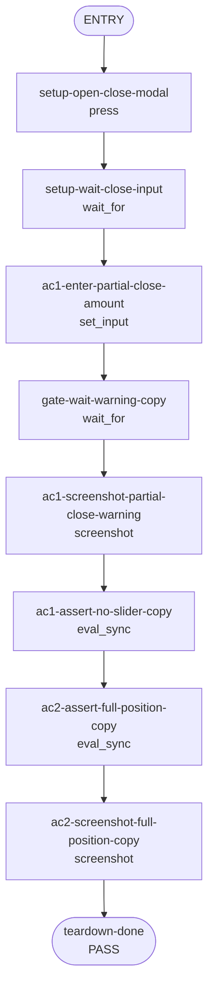

## **Description**

This updates the Perps partial-close minimum-notional warning so Extension users are not told to set a slider to 100%. The warning now directs users to increase the close amount or close the full position.

## **Changelog**

CHANGELOG entry: Fixed a Perps close-position warning that referenced the slider instead of closing the full position

## **Related issues**

Fixes: [TAT-2849](https://consensyssoftware.atlassian.net/browse/TAT-2849)

## **Manual testing steps**

1. Unlock the wallet and open the Perps tab.
2. Open an existing position and select Close.
3. Enter a partial close amount below the minimum notional.
4. Confirm the warning says to increase the close amount or close the full position, with no slider reference.
5. Confirm the unit test expectation is derived from the English i18n helper rather than duplicated localized copy.

## **Screenshots/Recordings**

Evidence will be populated from the generated evidence manifest.

### **Before**

<!-- evidence-manifest before screenshot/video placeholder -->

### **After**

<!-- evidence-manifest after screenshot/video placeholder -->

## **Pre-merge author checklist**

- [x] I've followed [MetaMask Contributor Docs](https://github.com/MetaMask/contributor-docs) and [MetaMask Extension Coding Standards](https://github.com/MetaMask/metamask-extension/blob/main/.github/guidelines/CODING_GUIDELINES.md).
- [x] I've completed the PR template to the best of my ability
- [x] I’ve included tests if applicable
- [x] I’ve documented my code using [JSDoc](https://jsdoc.app/) format if applicable
- [x] I’ve applied the right labels on the PR (see [labeling guidelines](https://github.com/MetaMask/metamask-extension/blob/main/.github/guidelines/LABELING_GUIDELINES.md)). Not required for external contributors.

## **Pre-merge reviewer checklist**

- [ ] I've manually tested the PR (e.g. pull and build branch, run the app, test code being changed).
- [ ] I confirm that this PR addresses all acceptance criteria described in the ticket it closes and includes the necessary testing evidence such as recordings and or screenshots.

## **Validation Recipe**

<details>
<summary>recipe.json</summary>

```json
{
  "title": "TAT-2849 partial close minimum-notional copy",
  "description": "Opens the Perps close-position modal, enters a partial close amount below the minimum notional, and verifies the warning copy references closing the full position instead of the slider.",
  "schema_version": 1,
  "validate": {
    "workflow": {
      "pre_conditions": [
        "wallet.unlocked",
        "perps.feature_enabled",
        "perps.ready_to_trade",
        "perps.sufficient_balance"
      ],
      "setup": [
        {
          "id": "setup-ensure-eth-position",
          "action": "call",
          "ref": "perps/open-long-position",
          "params": {
            "symbol": "ETH",
            "amount": "10"
          }
        }
      ],
      "entry": "setup-open-close-modal",
      "nodes": {
        "setup-open-close-modal": {
          "action": "press",
          "test_id": "perps-close-cta-button",
          "next": "setup-wait-close-input"
        },
        "setup-wait-close-input": {
          "action": "wait_for",
          "test_id": "close-amount-value",
          "timeout_ms": 10000,
          "next": "ac1-enter-partial-close-amount"
        },
        "ac1-enter-partial-close-amount": {
          "action": "set_input",
          "test_id": "close-amount-value",
          "value": "1",
          "next": "gate-wait-warning-copy"
        },
        "gate-wait-warning-copy": {
          "action": "wait_for",
          "expression": "Boolean((document.body.innerText || '').match(/Partial closes must be at least \\$\\d+(?:\\.\\d+)? in USD value\\./u))",
          "assert": {
            "operator": "eq",
            "field": "",
            "value": true
          },
          "timeout_ms": 10000,
          "next": "ac1-screenshot-partial-close-warning"
        },
        "ac1-screenshot-partial-close-warning": {
          "action": "screenshot",
          "filename": "evidence-ac1-partial-close-warning.png",
          "note": "AC1: partial close warning is visible in the close position modal",
          "next": "ac1-assert-no-slider-copy"
        },
        "ac1-assert-no-slider-copy": {
          "action": "eval_sync",
          "expression": "JSON.stringify((function(){var text=document.body.innerText||'';return {modalVisible:!!document.querySelector('[data-testid=\"perps-close-position-modal\"]'), warning:(text.match(/Partial closes[^\\n]+/)||[])[0]||'', referencesSlider:/\\bslider\\b|\\bslide\\b/iu.test(text), referencesFullPosition:/close the full position/iu.test(text)}})())",
          "assert": {
            "all": [
              {
                "operator": "eq",
                "field": "modalVisible",
                "value": true
              },
              {
                "operator": "eq",
                "field": "referencesSlider",
                "value": false
              }
            ]
          },
          "save_as": "ac1_copy_state",
          "next": "ac2-assert-full-position-copy"
        },
        "ac2-assert-full-position-copy": {
          "action": "eval_sync",
          "expression": "JSON.stringify((function(){var text=document.body.innerText||'';return {warning:(text.match(/Partial closes[^\\n]+/)||[])[0]||'', referencesFullPosition:/close the full position/iu.test(text)}})())",
          "assert": {
            "operator": "eq",
            "field": "referencesFullPosition",
            "value": true
          },
          "save_as": "ac2_copy_state",
          "next": "ac2-screenshot-full-position-copy"
        },
        "ac2-screenshot-full-position-copy": {
          "action": "screenshot",
          "filename": "evidence-ac2-partial-close-warning.png",
          "note": "AC2: partial close warning directs the user to close the full position",
          "next": "teardown-done"
        },
        "teardown-done": {
          "action": "end",
          "status": "pass",
          "message": "Partial close warning copy verified"
        }
      }
    }
  }
}
```

</details>

## **Recipe Workflow**

<details>
<summary>workflow.mmd</summary>



</details>
