## **Description**

Fixed the Perps order-entry TP/SL auto-close price generated from percentage input so it uses the shared market-aware Perps price precision instead of hardcoded 8-decimal normalization.

This keeps high-value markets such as BTC and XYZ100 at whole-number TP/SL prices, preserves exactly six decimals for sub-cent markets such as PUMP even when the rounded value ends in trailing zeros, and preserves mid-range market precision such as ETH.

Self-review follow-up removed unrelated image optimization diffs from the branch and switched the new market-precision regression to `userEvent`.

## **Changelog**

CHANGELOG entry: Fixed a bug that caused Perps TP/SL auto-close prices generated from percentage input to show too many decimal places for some markets.

## **Related issues**

Fixes: [TAT-3074](https://consensyssoftware.atlassian.net/browse/TAT-3074)

## **Manual testing steps**

1. Unlock MetaMask and open the Perps tab.
2. Open BTC, PUMP, XYZ100, and ETH market routes.
3. Expand Auto close in the order entry form, enter a Take Profit percentage, and verify the generated TP price precision matches the market precision.
4. For PUMP, verify low-value generated prices keep six decimal places, including trailing-zero values such as `0.002000`.

Automated validation:
- `yarn jest ui/components/app/perps/order-entry/components/auto-close-section/auto-close-section.test.tsx --no-coverage`
- `yarn lint:json && yarn lint:format && yarn lint:eslint && yarn lint:tsc && yarn lint:styles && yarn messenger-action-types:check && yarn verify-locales --quiet && yarn circular-deps:check`
- `node validate-recipe.js --recipe ../../temp/tasks/fix/tat-3074-0506-224809/artifacts/recipe.json --cdp-port 6661 --skip-manual`

## **Screenshots/Recordings**

Evidence is captured in the task artifact manifest and will be attached by the artifact gateway.

### **Before**

<!-- Uploaded before evidence will be inserted here. -->

### **After**

<!-- Uploaded after evidence will be inserted here. -->

## **Pre-merge author checklist**

- [x] I've followed [MetaMask Contributor Docs](https://github.com/MetaMask/contributor-docs) and [MetaMask Extension Coding Standards](https://github.com/MetaMask/metamask-extension/blob/main/.github/guidelines/CODING_GUIDELINES.md).
- [x] I've completed the PR template to the best of my ability
- [x] I’ve included tests if applicable
- [x] I’ve documented my code using [JSDoc](https://jsdoc.app/) format if applicable
- [x] I’ve applied the right labels on the PR (see [labeling guidelines](https://github.com/MetaMask/metamask-extension/blob/main/.github/guidelines/LABELING_GUIDELINES.md)). Not required for external contributors.

## **Pre-merge reviewer checklist**

- [ ] I've manually tested the PR (e.g. pull and build branch, run the app, test code being changed).
- [ ] I confirm that this PR addresses all acceptance criteria described in the ticket it closes and includes the necessary testing evidence such as recordings and or screenshots.

## **Validation Recipe**

<details>
<summary>recipe.json</summary>

```json
{
  "title": "TAT-3074 TP/SL generated price precision by market",
  "schema_version": 1,
  "description": "Navigate to Perps order entry, enable auto-close, enter a TP percentage, and assert the generated TP price field uses the market price precision for BTC, PUMP, XYZ100, and ETH.",
  "validate": {
    "workflow": {
      "pre_conditions": [
        "wallet.unlocked",
        "perps.feature_enabled"
      ],
      "entry": "setup-prime-perps",
      "nodes": {
        "setup-prime-perps": {
          "action": "call",
          "ref": "perps/prime-perps-state",
          "next": "ac1-navigate-btc"
        },
        "ac1-navigate-btc": {
          "action": "navigate",
          "target": "PerpsOrderEntry",
          "params": {
            "symbol": "BTC",
            "direction": "long"
          },
          "next": "ac1-wait-btc"
        },
        "ac1-wait-btc": {
          "action": "wait_for",
          "expression": "document.querySelector('[data-testid=\"perps-order-entry-asset-symbol\"]')?.textContent?.includes('BTC')",
          "timeout_ms": 15000,
          "next": "ac1-open-auto-close"
        },
        "ac1-open-auto-close": {
          "action": "eval_sync",
          "next": "ac1-enter-tp-percent",
          "expression": "(function(){const toggle=document.querySelector('[data-testid=\"auto-close-toggle\"]'); if(!toggle){return JSON.stringify({clicked:false,reason:'missing'});} if(!document.querySelector('[data-testid=\"tp-percent-input\"]')){toggle.click();} return JSON.stringify({clicked:true,enabled:!!document.querySelector('[data-testid=\"tp-percent-input\"]')});})()",
          "assert": {
            "operator": "eq",
            "field": "clicked",
            "value": true
          }
        },
        "ac1-enter-tp-percent": {
          "action": "set_input",
          "test_id": "tp-percent-input",
          "value": "7",
          "next": "ac1-blur-percent"
        },
        "ac1-blur-percent": {
          "action": "eval_sync",
          "expression": "(function(){document.querySelector('[data-testid=\"tp-percent-input\"] input')?.blur();return JSON.stringify({blurred:true});})()",
          "assert": {
            "operator": "eq",
            "field": "blurred",
            "value": true
          },
          "next": "ac1-assert-btc-price-precision"
        },
        "ac1-assert-btc-price-precision": {
          "action": "eval_sync",
          "expression": "(function(){const value=document.querySelector('[data-testid=\"tp-price-input\"] input')?.value||'';const decimals=value.includes('.')?value.split('.')[1].length:0;return JSON.stringify({value,decimals,hasValue:value.length>0});})()",
          "assert": {
            "all": [
              {
                "operator": "eq",
                "field": "hasValue",
                "value": true
              },
              {
                "operator": "eq",
                "field": "decimals",
                "value": 0
              }
            ]
          },
          "next": "ac1-screenshot-btc"
        },
        "ac1-screenshot-btc": {
          "action": "screenshot",
          "filename": "evidence-ac1-btc-tpsl-price.png",
          "note": "AC1: BTC TP price generated from 7% displays with 0 decimal places.",
          "next": "ac2-navigate-pump"
        },
        "ac2-navigate-pump": {
          "action": "navigate",
          "target": "PerpsOrderEntry",
          "params": {
            "symbol": "PUMP",
            "direction": "long"
          },
          "next": "ac2-wait-pump"
        },
        "ac2-wait-pump": {
          "action": "wait_for",
          "expression": "document.querySelector('[data-testid=\"perps-order-entry-asset-symbol\"]')?.textContent?.includes('PUMP')",
          "timeout_ms": 15000,
          "next": "ac2-open-auto-close"
        },
        "ac2-open-auto-close": {
          "action": "eval_sync",
          "next": "ac2-enter-tp-percent",
          "expression": "(function(){const toggle=document.querySelector('[data-testid=\"auto-close-toggle\"]'); if(!toggle){return JSON.stringify({clicked:false,reason:'missing'});} if(!document.querySelector('[data-testid=\"tp-percent-input\"]')){toggle.click();} return JSON.stringify({clicked:true,enabled:!!document.querySelector('[data-testid=\"tp-percent-input\"]')});})()",
          "assert": {
            "operator": "eq",
            "field": "clicked",
            "value": true
          }
        },
        "ac2-enter-tp-percent": {
          "action": "set_input",
          "test_id": "tp-percent-input",
          "value": "7",
          "next": "ac2-blur-percent"
        },
        "ac2-blur-percent": {
          "action": "eval_sync",
          "expression": "(function(){document.querySelector('[data-testid=\"tp-percent-input\"] input')?.blur();return JSON.stringify({blurred:true});})()",
          "assert": {
            "operator": "eq",
            "field": "blurred",
            "value": true
          },
          "next": "ac2-assert-pump-price-precision"
        },
        "ac2-assert-pump-price-precision": {
          "action": "eval_sync",
          "expression": "(function(){const value=document.querySelector('[data-testid=\"tp-price-input\"] input')?.value||'';const decimals=value.includes('.')?value.split('.')[1].length:0;return JSON.stringify({value,decimals,hasValue:value.length>0});})()",
          "assert": {
            "all": [
              {
                "operator": "eq",
                "field": "hasValue",
                "value": true
              },
              {
                "operator": "eq",
                "field": "decimals",
                "value": 6
              }
            ]
          },
          "next": "ac2-screenshot-pump"
        },
        "ac2-screenshot-pump": {
          "action": "screenshot",
          "filename": "evidence-ac2-pump-tpsl-price.png",
          "note": "AC2: PUMP TP price generated from 7% displays with 6 decimal places.",
          "next": "ac3-navigate-xyz100"
        },
        "ac3-navigate-xyz100": {
          "action": "navigate",
          "target": "PerpsOrderEntry",
          "params": {
            "symbol": "xyz:XYZ100",
            "direction": "long"
          },
          "next": "ac3-wait-xyz100"
        },
        "ac3-wait-xyz100": {
          "action": "wait_for",
          "expression": "document.querySelector('[data-testid=\"perps-order-entry-asset-symbol\"]')?.textContent?.includes('XYZ100')",
          "timeout_ms": 15000,
          "next": "ac3-open-auto-close"
        },
        "ac3-open-auto-close": {
          "action": "eval_sync",
          "next": "ac3-enter-tp-percent",
          "expression": "(function(){const toggle=document.querySelector('[data-testid=\"auto-close-toggle\"]'); if(!toggle){return JSON.stringify({clicked:false,reason:'missing'});} if(!document.querySelector('[data-testid=\"tp-percent-input\"]')){toggle.click();} return JSON.stringify({clicked:true,enabled:!!document.querySelector('[data-testid=\"tp-percent-input\"]')});})()",
          "assert": {
            "operator": "eq",
            "field": "clicked",
            "value": true
          }
        },
        "ac3-enter-tp-percent": {
          "action": "set_input",
          "test_id": "tp-percent-input",
          "value": "7",
          "next": "ac3-blur-percent"
        },
        "ac3-blur-percent": {
          "action": "eval_sync",
          "expression": "(function(){document.querySelector('[data-testid=\"tp-percent-input\"] input')?.blur();return JSON.stringify({blurred:true});})()",
          "assert": {
            "operator": "eq",
            "field": "blurred",
            "value": true
          },
          "next": "ac3-assert-xyz100-price-precision"
        },
        "ac3-assert-xyz100-price-precision": {
          "action": "eval_sync",
          "expression": "(function(){const value=document.querySelector('[data-testid=\"tp-price-input\"] input')?.value||'';const decimals=value.includes('.')?value.split('.')[1].length:0;return JSON.stringify({value,decimals,hasValue:value.length>0});})()",
          "assert": {
            "all": [
              {
                "operator": "eq",
                "field": "hasValue",
                "value": true
              },
              {
                "operator": "eq",
                "field": "decimals",
                "value": 0
              }
            ]
          },
          "next": "ac3-screenshot-xyz100"
        },
        "ac3-screenshot-xyz100": {
          "action": "screenshot",
          "filename": "evidence-ac3-xyz100-tpsl-price.png",
          "note": "AC3: XYZ100 TP price generated from 7% displays with 0 decimal places.",
          "next": "ac4-navigate-eth"
        },
        "ac4-navigate-eth": {
          "action": "navigate",
          "target": "PerpsOrderEntry",
          "params": {
            "symbol": "ETH",
            "direction": "long"
          },
          "next": "ac4-wait-eth"
        },
        "ac4-wait-eth": {
          "action": "wait_for",
          "expression": "document.querySelector('[data-testid=\"perps-order-entry-asset-symbol\"]')?.textContent?.includes('ETH')",
          "timeout_ms": 15000,
          "next": "ac4-open-auto-close"
        },
        "ac4-open-auto-close": {
          "action": "eval_sync",
          "next": "ac4-enter-tp-percent",
          "expression": "(function(){const toggle=document.querySelector('[data-testid=\"auto-close-toggle\"]'); if(!toggle){return JSON.stringify({clicked:false,reason:'missing'});} if(!document.querySelector('[data-testid=\"tp-percent-input\"]')){toggle.click();} return JSON.stringify({clicked:true,enabled:!!document.querySelector('[data-testid=\"tp-percent-input\"]')});})()",
          "assert": {
            "operator": "eq",
            "field": "clicked",
            "value": true
          }
        },
        "ac4-enter-tp-percent": {
          "action": "set_input",
          "test_id": "tp-percent-input",
          "value": "7",
          "next": "ac4-blur-percent"
        },
        "ac4-blur-percent": {
          "action": "eval_sync",
          "expression": "(function(){document.querySelector('[data-testid=\"tp-percent-input\"] input')?.blur();return JSON.stringify({blurred:true});})()",
          "assert": {
            "operator": "eq",
            "field": "blurred",
            "value": true
          },
          "next": "ac4-assert-eth-price-precision"
        },
        "ac4-assert-eth-price-precision": {
          "action": "eval_sync",
          "expression": "(function(){const value=document.querySelector('[data-testid=\"tp-price-input\"] input')?.value||'';const decimals=value.includes('.')?value.split('.')[1].length:0;return JSON.stringify({value,decimals,hasValue:value.length>0});})()",
          "assert": {
            "all": [
              {
                "operator": "eq",
                "field": "hasValue",
                "value": true
              },
              {
                "operator": "lte",
                "field": "decimals",
                "value": 1
              }
            ]
          },
          "next": "ac4-screenshot-eth"
        },
        "ac4-screenshot-eth": {
          "action": "screenshot",
          "filename": "evidence-ac4-eth-tpsl-price.png",
          "note": "AC4: ETH TP price generated from 7% displays with at most 1 decimal place.",
          "next": "teardown-done"
        },
        "teardown-done": {
          "action": "end",
          "status": "pass"
        }
      }
    }
  }
}
```

</details>

## **Recipe Workflow**

```mermaid
flowchart TD
  %% TAT-3074 TP/SL generated price precision by market
  __entry__(["ENTRY"]) --> node_setup_prime_perps
  node_setup_prime_perps[["setup-prime-perps<br/>perps/prime-perps-state"]]
  node_ac1_navigate_btc["ac1-navigate-btc<br/>navigate"]
  node_ac1_wait_btc["ac1-wait-btc<br/>wait_for"]
  node_ac1_open_auto_close["ac1-open-auto-close<br/>eval_sync"]
  node_ac1_enter_tp_percent["ac1-enter-tp-percent<br/>set_input"]
  node_ac1_blur_percent["ac1-blur-percent<br/>eval_sync"]
  node_ac1_assert_btc_price_precision["ac1-assert-btc-price-precision<br/>eval_sync"]
  node_ac1_screenshot_btc["ac1-screenshot-btc<br/>screenshot"]
  node_ac2_navigate_pump["ac2-navigate-pump<br/>navigate"]
  node_ac2_wait_pump["ac2-wait-pump<br/>wait_for"]
  node_ac2_open_auto_close["ac2-open-auto-close<br/>eval_sync"]
  node_ac2_enter_tp_percent["ac2-enter-tp-percent<br/>set_input"]
  node_ac2_blur_percent["ac2-blur-percent<br/>eval_sync"]
  node_ac2_assert_pump_price_precision["ac2-assert-pump-price-precision<br/>eval_sync"]
  node_ac2_screenshot_pump["ac2-screenshot-pump<br/>screenshot"]
  node_ac3_navigate_xyz100["ac3-navigate-xyz100<br/>navigate"]
  node_ac3_wait_xyz100["ac3-wait-xyz100<br/>wait_for"]
  node_ac3_open_auto_close["ac3-open-auto-close<br/>eval_sync"]
  node_ac3_enter_tp_percent["ac3-enter-tp-percent<br/>set_input"]
  node_ac3_blur_percent["ac3-blur-percent<br/>eval_sync"]
  node_ac3_assert_xyz100_price_precision["ac3-assert-xyz100-price-precision<br/>eval_sync"]
  node_ac3_screenshot_xyz100["ac3-screenshot-xyz100<br/>screenshot"]
  node_ac4_navigate_eth["ac4-navigate-eth<br/>navigate"]
  node_ac4_wait_eth["ac4-wait-eth<br/>wait_for"]
  node_ac4_open_auto_close["ac4-open-auto-close<br/>eval_sync"]
  node_ac4_enter_tp_percent["ac4-enter-tp-percent<br/>set_input"]
  node_ac4_blur_percent["ac4-blur-percent<br/>eval_sync"]
  node_ac4_assert_eth_price_precision["ac4-assert-eth-price-precision<br/>eval_sync"]
  node_ac4_screenshot_eth["ac4-screenshot-eth<br/>screenshot"]
  node_teardown_done(["teardown-done<br/>PASS"])
  node_setup_prime_perps --> node_ac1_navigate_btc
  node_ac1_navigate_btc --> node_ac1_wait_btc
  node_ac1_wait_btc --> node_ac1_open_auto_close
  node_ac1_open_auto_close --> node_ac1_enter_tp_percent
  node_ac1_enter_tp_percent --> node_ac1_blur_percent
  node_ac1_blur_percent --> node_ac1_assert_btc_price_precision
  node_ac1_assert_btc_price_precision --> node_ac1_screenshot_btc
  node_ac1_screenshot_btc --> node_ac2_navigate_pump
  node_ac2_navigate_pump --> node_ac2_wait_pump
  node_ac2_wait_pump --> node_ac2_open_auto_close
  node_ac2_open_auto_close --> node_ac2_enter_tp_percent
  node_ac2_enter_tp_percent --> node_ac2_blur_percent
  node_ac2_blur_percent --> node_ac2_assert_pump_price_precision
  node_ac2_assert_pump_price_precision --> node_ac2_screenshot_pump
  node_ac2_screenshot_pump --> node_ac3_navigate_xyz100
  node_ac3_navigate_xyz100 --> node_ac3_wait_xyz100
  node_ac3_wait_xyz100 --> node_ac3_open_auto_close
  node_ac3_open_auto_close --> node_ac3_enter_tp_percent
  node_ac3_enter_tp_percent --> node_ac3_blur_percent
  node_ac3_blur_percent --> node_ac3_assert_xyz100_price_precision
  node_ac3_assert_xyz100_price_precision --> node_ac3_screenshot_xyz100
  node_ac3_screenshot_xyz100 --> node_ac4_navigate_eth
  node_ac4_navigate_eth --> node_ac4_wait_eth
  node_ac4_wait_eth --> node_ac4_open_auto_close
  node_ac4_open_auto_close --> node_ac4_enter_tp_percent
  node_ac4_enter_tp_percent --> node_ac4_blur_percent
  node_ac4_blur_percent --> node_ac4_assert_eth_price_precision
  node_ac4_assert_eth_price_precision --> node_ac4_screenshot_eth
  node_ac4_screenshot_eth --> node_teardown_done
```

<details>
<summary>workflow.mmd</summary>



</details>
