<!--
Please submit this PR as a draft initially.
Do not mark it as "Ready for review" until the template has been completely filled out, and PR status checks have passed at least once.
-->

## **Description**

Fixes the Perps Recent activity affordance so the full header row is tappable on both the Perps tab and Perp market detail page. Previously only the arrow icon was inside the button target.

## **Changelog**

CHANGELOG entry: Fixed a bug that made only the Recent activity arrow tappable in Perps.

## **Related issues**

Fixes: [TAT-3077](https://consensyssoftware.atlassian.net/browse/TAT-3077)

## **Manual testing steps**

1. Open MetaMask and go to the Perps tab with recent activity.
2. Click the Recent activity header text, not just the arrow.
3. Confirm the Perps activity page opens.
4. Open a Perp market detail page with recent activity.
5. Click the Recent activity header text and confirm the Perps activity page opens.

## **Screenshots/Recordings**

Before/after screenshots show Recent activity rows on Perps home and market detail; trace assertions prove left-side row hit targets now resolve to the row buttons.

<table>
<tr><td colspan="2"><strong>Perps tab Recent activity row — Trace verifies the left side of this header row hits perps-recent-activity-see-all after the fix.</strong></td></tr>
<tr>
<td align="center" width="50%"><em>Before</em><br/></td>
<td align="center" width="50%"><em>After</em><br/></td>
</tr>
<tr><td colspan="2"><strong>Market detail Recent activity row — Trace verifies the left side of this header row hits perps-market-detail-view-all-activity after the fix.</strong></td></tr>
<tr>
<td align="center" width="50%"><em>Before</em><br/></td>
<td align="center" width="50%"><em>After</em><br/></td>
</tr>
</table>


**Video**
Screenshots plus trace assertions are the preferred evidence.
<table>
<tr><td align="center" width="50%"><em>Before</em><br/><a href="https://raw.githubusercontent.com/abretonc7s/mm-extension-farm-artifacts/main/fixes/42676/before.mp4">before.mp4</a></td>
<td align="center" width="50%"><em>After</em><br/><a href="https://raw.githubusercontent.com/abretonc7s/mm-extension-farm-artifacts/main/fixes/42676/after.mp4">after.mp4</a></td></tr>
</table>

## **Pre-merge author checklist**

- [x] I've followed [MetaMask Contributor Docs](https://github.com/MetaMask/contributor-docs) and [MetaMask Extension Coding Standards](https://github.com/MetaMask/metamask-extension/blob/main/.github/guidelines/CODING_GUIDELINES.md).
- [x] I've completed the PR template to the best of my ability
- [x] I’ve included tests if applicable
- [x] I’ve documented my code using [JSDoc](https://jsdoc.app/) format if applicable
- [x] I’ve applied the right labels on the PR (see [labeling guidelines](https://github.com/MetaMask/metamask-extension/blob/main/.github/guidelines/LABELING_GUIDELINES.md)). Not required for external contributors.

## **Pre-merge reviewer checklist**

- [ ] I've manually tested the PR (e.g. pull and build branch, run the app, test code being changed).
- [ ] I confirm that this PR addresses all acceptance criteria described in the ticket it closes and includes the necessary testing evidence such as recordings and or screenshots.

## **Validation Recipe**

<details><summary>recipe.json</summary>

```json
{
  "title": "TAT-3077 — Recent activity header rows are fully tappable",
  "description": "Validates that the left side of the Recent activity header row is inside the tappable ButtonBase on the Perps tab and Perp market detail page.",
  "schema_version": 1,
  "validate": {
    "workflow": {
      "pre_conditions": ["wallet.unlocked", "perps.feature_enabled"],
      "entry": "setup-open-position",
      "nodes": {
        "setup-open-position": {
          "action": "call",
          "ref": "perps/open-long-position",
          "params": { "symbol": "ETH", "side": "long", "amount": "10" },
          "next": "setup-nav-perps-tab"
        },
        "setup-nav-perps-tab": {
          "action": "call",
          "ref": "perps/navigate-perps-tab",
          "next": "ac1-wait-recent-activity"
        },
        "ac1-wait-recent-activity": {
          "action": "wait_for",
          "test_id": "perps-recent-activity-see-all",
          "timeout_ms": 10000,
          "next": "ac1-scroll-recent-activity"
        },
        "ac1-scroll-recent-activity": {
          "action": "scroll",
          "test_id": "perps-recent-activity-see-all",
          "next": "ac1-assert-row-hit-target"
        },
        "ac1-assert-row-hit-target": {
          "action": "eval_sync",
          "expression": "(function(){var testId='perps-recent-activity-see-all';var btn=document.querySelector('[data-testid=\"'+testId+'\"]');if(!btn){return JSON.stringify({ok:false,reason:'missing button'});}var parent=btn.parentElement||btn;var parentRect=parent.getBoundingClientRect();var btnRect=btn.getBoundingClientRect();var probeX=parentRect.left+Math.min(40,parentRect.width/4);var probeY=btnRect.top+(btnRect.height/2);var hit=document.elementFromPoint(probeX,probeY);var target=hit&&hit.closest('[data-testid=\"'+testId+'\"]');return JSON.stringify({ok:target===btn,buttonWidth:Math.round(btnRect.width),rowWidth:Math.round(parentRect.width),probeX:Math.round(probeX),probeY:Math.round(probeY),hitTestId:(target&&target.getAttribute('data-testid'))||(hit&&hit.getAttribute&&hit.getAttribute('data-testid'))||null});})()",
          "assert": { "operator": "eq", "field": "ok", "value": true },
          "save_as": "ac1_hit_target",
          "next": "ac1-screenshot-recent-activity-row"
        },
        "ac1-screenshot-recent-activity-row": {
          "action": "screenshot",
          "filename": "evidence-ac1-perps-recent-activity-row",
          "note": "AC1: Perps tab Recent activity header row is visible after hit-target assertion",
          "next": "setup-nav-market-detail"
        },
        "setup-nav-market-detail": {
          "action": "call",
          "ref": "perps/navigate-to-market-detail",
          "params": { "symbol": "ETH" },
          "next": "ac2-wait-recent-activity"
        },
        "ac2-wait-recent-activity": {
          "action": "wait_for",
          "test_id": "perps-market-detail-view-all-activity",
          "timeout_ms": 10000,
          "next": "ac2-scroll-recent-activity"
        },
        "ac2-scroll-recent-activity": {
          "action": "scroll",
          "test_id": "perps-market-detail-view-all-activity",
          "next": "ac2-assert-row-hit-target"
        },
        "ac2-assert-row-hit-target": {
          "action": "eval_sync",
          "expression": "(function(){var testId='perps-market-detail-view-all-activity';var btn=document.querySelector('[data-testid=\"'+testId+'\"]');if(!btn){return JSON.stringify({ok:false,reason:'missing button'});}var parent=btn.parentElement||btn;var parentRect=parent.getBoundingClientRect();var btnRect=btn.getBoundingClientRect();var probeX=parentRect.left+Math.min(40,parentRect.width/4);var probeY=btnRect.top+(btnRect.height/2);var hit=document.elementFromPoint(probeX,probeY);var target=hit&&hit.closest('[data-testid=\"'+testId+'\"]');return JSON.stringify({ok:target===btn,buttonWidth:Math.round(btnRect.width),rowWidth:Math.round(parentRect.width),probeX:Math.round(probeX),probeY:Math.round(probeY),hitTestId:(target&&target.getAttribute('data-testid'))||(hit&&hit.getAttribute&&hit.getAttribute('data-testid'))||null});})()",
          "assert": { "operator": "eq", "field": "ok", "value": true },
          "save_as": "ac2_hit_target",
          "next": "ac2-screenshot-recent-activity-row"
        },
        "ac2-screenshot-recent-activity-row": {
          "action": "screenshot",
          "filename": "evidence-ac2-market-recent-activity-row",
          "note": "AC2: Market detail Recent activity header row is visible after hit-target assertion",
          "next": "teardown-done"
        },
        "teardown-done": {
          "action": "end",
          "status": "pass"
        }
      }
    }
  }
}

```

</details>

## **Recipe Workflow**

```mermaid
flowchart TD
  %% TAT-3077 — Recent activity header rows are fully tappable
  __entry__(["ENTRY"]) --> node_setup_open_position
  node_setup_open_position[["setup-open-position<br/>perps/open-long-position"]]
  node_setup_nav_perps_tab[["setup-nav-perps-tab<br/>perps/navigate-perps-tab"]]
  node_ac1_wait_recent_activity["ac1-wait-recent-activity<br/>wait_for"]
  node_ac1_scroll_recent_activity["ac1-scroll-recent-activity<br/>scroll"]
  node_ac1_assert_row_hit_target["ac1-assert-row-hit-target<br/>eval_sync"]
  node_ac1_screenshot_recent_activity_row["ac1-screenshot-recent-activity-row<br/>screenshot"]
  node_setup_nav_market_detail[["setup-nav-market-detail<br/>perps/navigate-to-market-detail"]]
  node_ac2_wait_recent_activity["ac2-wait-recent-activity<br/>wait_for"]
  node_ac2_scroll_recent_activity["ac2-scroll-recent-activity<br/>scroll"]
  node_ac2_assert_row_hit_target["ac2-assert-row-hit-target<br/>eval_sync"]
  node_ac2_screenshot_recent_activity_row["ac2-screenshot-recent-activity-row<br/>screenshot"]
  node_teardown_done(["teardown-done<br/>PASS"])
  node_setup_open_position --> node_setup_nav_perps_tab
  node_setup_nav_perps_tab --> node_ac1_wait_recent_activity
  node_ac1_wait_recent_activity --> node_ac1_scroll_recent_activity
  node_ac1_scroll_recent_activity --> node_ac1_assert_row_hit_target
  node_ac1_assert_row_hit_target --> node_ac1_screenshot_recent_activity_row
  node_ac1_screenshot_recent_activity_row --> node_setup_nav_market_detail
  node_setup_nav_market_detail --> node_ac2_wait_recent_activity
  node_ac2_wait_recent_activity --> node_ac2_scroll_recent_activity
  node_ac2_scroll_recent_activity --> node_ac2_assert_row_hit_target
  node_ac2_assert_row_hit_target --> node_ac2_screenshot_recent_activity_row
  node_ac2_screenshot_recent_activity_row --> node_teardown_done

```

<details><summary>workflow.mmd</summary>



</details>

[TAT-3077]: https://consensyssoftware.atlassian.net/browse/TAT-3077?atlOrigin=eyJpIjoiNWRkNTljNzYxNjVmNDY3MDlhMDU5Y2ZhYzA5YTRkZjUiLCJwIjoiZ2l0aHViLWNvbS1KU1cifQ

<!-- CURSOR_SUMMARY -->
---

> [!NOTE]
> **Low Risk**
> Low risk UI interaction change that broadens the click target for navigation; only affects Perps recent-activity headers and related tests.
> 
> **Overview**
> Fixes the Perps recent-activity header affordance by turning the entire header row (label + chevron) into a single `ButtonBase` that navigates to `PERPS_ACTIVITY_ROUTE`.
> 
> Applies this behavior to both `PerpsRecentActivity` and `PerpsMarketRecentActivity`, while preserving the non-clickable header in the market detail empty state, and adds tests to verify navigation when clicking the header text (using `userEvent`).
> 
> <sup>Reviewed by [Cursor Bugbot](https://cursor.com/bugbot) for commit 5cc7bd076ff4e5c1e7055cd154a7c84988533967. Bugbot is set up for automated code reviews on this repo. Configure [here](https://www.cursor.com/dashboard/bugbot).</sup>
<!-- /CURSOR_SUMMARY -->

