## **Description**

Fixes Perps market token logos that were difficult to see in certain theme/asset combinations. Mirrors mobile's per-asset background config:

- `ASSETS_REQUIRING_LIGHT_BG` (ETH, XRP, UNI, …) — apply white bg in **dark** mode so dark-on-transparent logos stay visible.
- `ASSETS_REQUIRING_DARK_BG` (S, RESOLV, IO, SOPH, …) — apply dark bg in **light** mode so white-on-transparent logos stay visible.
- All other tokens fall back to the AvatarToken default (no override).

The earlier iteration applied `bg-white` universally, which hid tokens with white/light logos. This commit narrows to the mobile algorithm so both directions are handled.

## **Changelog**

CHANGELOG entry: Fixed Perps market token logos that were difficult to see in dark mode

## **Related issues**

Fixes: [TAT-2964](https://consensyssoftware.atlassian.net/browse/TAT-2964)

## **Manual testing steps**

1. Unlock the extension wallet.
2. Open the Perps tab in dark mode and confirm visible market logos, including ETH, render on white circular backgrounds.
3. Open the ETH Perps market detail page and confirm the ETH logo renders clearly on a white circular background.
4. Switch to light mode and confirm tokens in ASSETS_REQUIRING_DARK_BG (e.g., S, RESOLV, IO) render on a dark circular background.

## **Screenshots/Recordings**

Evidence re-validation pending — the initial recipe captured ETH only and missed the white-on-white regression introduced by the universal `bg-white` approach. New evidence will cover both `ASSETS_REQUIRING_LIGHT_BG` (ETH dark mode) and `ASSETS_REQUIRING_DARK_BG` (S/RESOLV light mode).

## **Pre-merge author checklist**

- [x] I've followed [MetaMask Contributor Docs](https://github.com/MetaMask/contributor-docs) and [MetaMask Extension Coding Standards](https://github.com/MetaMask/metamask-extension/blob/main/.github/guidelines/CODING_GUIDELINES.md).
- [x] I've completed the PR template to the best of my ability
- [x] I’ve included tests if applicable
- [x] I’ve documented my code using [JSDoc](https://jsdoc.app/) format if applicable
- [x] I’ve applied the right labels on the PR (see [labeling guidelines](https://github.com/MetaMask/metamask-extension/blob/main/.github/guidelines/LABELING_GUIDELINES.md)). Not required for external contributors.

## **Pre-merge reviewer checklist**

- [ ] I've manually tested the PR (e.g. pull and build branch, run the app, test code being changed).
- [ ] I confirm that this PR addresses all acceptance criteria described in the ticket it closes and includes the necessary testing evidence such as recordings and or screenshots.

## **Validation Recipe**

<details>
<summary>recipe.json</summary>

```json
{
  "description": "Validates that Perps market logos render with a white background on market list and detail screens in dark and light mode.",
  "title": "TAT-2964 Perps market logo contrast",
  "validate": {
    "workflow": {
      "pre_conditions": ["wallet.unlocked", "perps.feature_enabled"],
      "entry": "setup-dark-mode",
      "nodes": {
        "setup-dark-mode": {
          "action": "emulation",
          "emulation": "media",
          "color_scheme": "dark",
          "next": "setup-nav-perps-list-dark"
        },
        "setup-nav-perps-list-dark": {
          "action": "call",
          "ref": "bundle/perps-list",
          "next": "setup-wait-list-dark"
        },
        "setup-wait-list-dark": {
          "action": "wait_for",
          "test_id": "perps-token-logo-ETH",
          "timeout_ms": 10000,
          "next": "ac1-assert-list-dark-logos"
        },
        "ac1-assert-list-dark-logos": {
          "action": "eval_sync",
          "expression": "(function(){var logos=[].slice.call(document.querySelectorAll('[data-testid^=\"perps-token-logo-\"]'));var rows=[];for(var i=0;i<logos.length;i++){var n=logos[i];var id=n.getAttribute('data-testid')||'';var bg=window.getComputedStyle(n).backgroundColor;var img=n.querySelector('img');if(img){rows.push({id:id,backgroundColor:bg,hasWhiteBackground:bg==='rgb(255, 255, 255)'||bg==='rgba(255, 255, 255, 1)'})}}var failing=rows.filter(function(r){return !r.hasWhiteBackground});return JSON.stringify({screen:'market-list-dark',logoCount:rows.length,failingCount:failing.length,failing:failing.slice(0,5),eth:rows.filter(function(r){return r.id==='perps-token-logo-ETH'})})})()",
          "assert": {
            "all": [
              { "field": "logoCount", "operator": "gt", "value": 0 },
              { "field": "failingCount", "operator": "eq", "value": 0 }
            ]
          },
          "next": "ac2-assert-eth-list-dark-white"
        },
        "ac2-assert-eth-list-dark-white": {
          "action": "eval_sync",
          "expression": "(function(){var n=document.querySelector('[data-testid=\"perps-token-logo-ETH\"]');var img=n&&n.querySelector('img');var bg=n?window.getComputedStyle(n).backgroundColor:null;return JSON.stringify({present:!!n,hasImage:!!img,backgroundColor:bg,hasWhiteBackground:bg==='rgb(255, 255, 255)'||bg==='rgba(255, 255, 255, 1)'})})()",
          "assert": {
            "all": [
              { "field": "present", "operator": "eq", "value": true },
              { "field": "hasImage", "operator": "eq", "value": true },
              { "field": "hasWhiteBackground", "operator": "eq", "value": true }
            ]
          },
          "next": "ac2-screenshot-list-dark"
        },
        "ac2-screenshot-list-dark": {
          "action": "screenshot",
          "filename": "evidence-ac2-list-dark",
          "note": "AC2: Perps market list logos render on white circular backgrounds in dark mode",
          "next": "setup-nav-eth-detail-dark"
        },
        "setup-nav-eth-detail-dark": {
          "action": "call",
          "ref": "perps/navigate-to-market-detail",
          "params": { "symbol": "ETH" },
          "next": "setup-wait-detail-dark"
        },
        "setup-wait-detail-dark": {
          "action": "wait_for",
          "test_id": "perps-market-detail-page",
          "timeout_ms": 10000,
          "next": "setup-wait-detail-eth-image-dark"
        },
        "setup-wait-detail-eth-image-dark": {
          "action": "wait_for",
          "expression": "!!document.querySelector('[data-testid=\"perps-market-detail-page\"] [data-testid=\"perps-token-logo-ETH\"] img')",
          "timeout_ms": 10000,
          "assert": { "operator": "eq", "value": true },
          "next": "ac3-assert-eth-detail-dark-white"
        },
        "ac3-assert-eth-detail-dark-white": {
          "action": "eval_sync",
          "expression": "(function(){var n=document.querySelector('[data-testid=\"perps-market-detail-page\"] [data-testid=\"perps-token-logo-ETH\"]');var img=n&&n.querySelector('img');var bg=n?window.getComputedStyle(n).backgroundColor:null;return JSON.stringify({present:!!n,hasImage:!!img,backgroundColor:bg,hasWhiteBackground:bg==='rgb(255, 255, 255)'||bg==='rgba(255, 255, 255, 1)'})})()",
          "assert": {
            "all": [
              { "field": "present", "operator": "eq", "value": true },
              { "field": "hasImage", "operator": "eq", "value": true },
              { "field": "hasWhiteBackground", "operator": "eq", "value": true }
            ]
          },
          "next": "ac3-screenshot-detail-dark"
        },
        "ac3-screenshot-detail-dark": {
          "action": "screenshot",
          "filename": "evidence-ac3-detail-dark",
          "note": "AC3: ETH Perps detail logo renders clearly on a white circular background in dark mode",
          "next": "setup-light-mode"
        },
        "setup-light-mode": {
          "action": "emulation",
          "emulation": "media",
          "color_scheme": "light",
          "next": "setup-nav-perps-list-light"
        },
        "setup-nav-perps-list-light": {
          "action": "call",
          "ref": "bundle/perps-list",
          "next": "setup-wait-list-light"
        },
        "setup-wait-list-light": {
          "action": "wait_for",
          "test_id": "perps-token-logo-ETH",
          "timeout_ms": 10000,
          "next": "ac4-assert-list-light-logos"
        },
        "ac4-assert-list-light-logos": {
          "action": "eval_sync",
          "expression": "(function(){var logos=[].slice.call(document.querySelectorAll('[data-testid^=\"perps-token-logo-\"]'));var rows=[];for(var i=0;i<logos.length;i++){var n=logos[i];var id=n.getAttribute('data-testid')||'';var bg=window.getComputedStyle(n).backgroundColor;var img=n.querySelector('img');if(img){rows.push({id:id,backgroundColor:bg,hasWhiteBackground:bg==='rgb(255, 255, 255)'||bg==='rgba(255, 255, 255, 1)'})}}var failing=rows.filter(function(r){return !r.hasWhiteBackground});return JSON.stringify({screen:'market-list-light',logoCount:rows.length,failingCount:failing.length,failing:failing.slice(0,5),eth:rows.filter(function(r){return r.id==='perps-token-logo-ETH'})})})()",
          "assert": {
            "all": [
              { "field": "logoCount", "operator": "gt", "value": 0 },
              { "field": "failingCount", "operator": "eq", "value": 0 }
            ]
          },
          "next": "ac4-screenshot-list-light"
        },
        "ac4-screenshot-list-light": {
          "action": "screenshot",
          "filename": "evidence-ac4-list-light",
          "note": "AC4: Perps market list logos retain white backgrounds in light mode",
          "next": "done"
        },
        "done": {
          "action": "end",
          "status": "pass"
        }
      }
    }
  }
}
```

</details>

## **Recipe Workflow**

```mermaid
flowchart TD
  %% TAT-2964 Perps market logo contrast
  __entry__(["ENTRY"]) --> node_setup_dark_mode
  node_setup_dark_mode["setup-dark-mode<br/>emulation"]
  node_setup_nav_perps_list_dark[["setup-nav-perps-list-dark<br/>bundle/perps-list"]]
  node_setup_wait_list_dark["setup-wait-list-dark<br/>wait_for"]
  node_ac1_assert_list_dark_logos["ac1-assert-list-dark-logos<br/>eval_sync"]
  node_ac2_assert_eth_list_dark_white["ac2-assert-eth-list-dark-white<br/>eval_sync"]
  node_ac2_screenshot_list_dark["ac2-screenshot-list-dark<br/>screenshot"]
  node_setup_nav_eth_detail_dark[["setup-nav-eth-detail-dark<br/>perps/navigate-to-market-detail"]]
  node_setup_wait_detail_dark["setup-wait-detail-dark<br/>wait_for"]
  node_setup_wait_detail_eth_image_dark["setup-wait-detail-eth-image-dark<br/>wait_for"]
  node_ac3_assert_eth_detail_dark_white["ac3-assert-eth-detail-dark-white<br/>eval_sync"]
  node_ac3_screenshot_detail_dark["ac3-screenshot-detail-dark<br/>screenshot"]
  node_setup_light_mode["setup-light-mode<br/>emulation"]
  node_setup_nav_perps_list_light[["setup-nav-perps-list-light<br/>bundle/perps-list"]]
  node_setup_wait_list_light["setup-wait-list-light<br/>wait_for"]
  node_ac4_assert_list_light_logos["ac4-assert-list-light-logos<br/>eval_sync"]
  node_ac4_screenshot_list_light["ac4-screenshot-list-light<br/>screenshot"]
  node_done(["done<br/>PASS"])
  node_setup_dark_mode --> node_setup_nav_perps_list_dark
  node_setup_nav_perps_list_dark --> node_setup_wait_list_dark
  node_setup_wait_list_dark --> node_ac1_assert_list_dark_logos
  node_ac1_assert_list_dark_logos --> node_ac2_assert_eth_list_dark_white
  node_ac2_assert_eth_list_dark_white --> node_ac2_screenshot_list_dark
  node_ac2_screenshot_list_dark --> node_setup_nav_eth_detail_dark
  node_setup_nav_eth_detail_dark --> node_setup_wait_detail_dark
  node_setup_wait_detail_dark --> node_setup_wait_detail_eth_image_dark
  node_setup_wait_detail_eth_image_dark --> node_ac3_assert_eth_detail_dark_white
  node_ac3_assert_eth_detail_dark_white --> node_ac3_screenshot_detail_dark
  node_ac3_screenshot_detail_dark --> node_setup_light_mode
  node_setup_light_mode --> node_setup_nav_perps_list_light
  node_setup_nav_perps_list_light --> node_setup_wait_list_light
  node_setup_wait_list_light --> node_ac4_assert_list_light_logos
  node_ac4_assert_list_light_logos --> node_ac4_screenshot_list_light
  node_ac4_screenshot_list_light --> node_done
```

<details>
<summary>workflow.mmd</summary>



</details>

[TAT-2964]: https://consensyssoftware.atlassian.net/browse/TAT-2964?atlOrigin=eyJpIjoiNWRkNTljNzYxNjVmNDY3MDlhMDU5Y2ZhYzA5YTRkZjUiLCJwIjoiZ2l0aHViLWNvbS1KU1cifQ

<!-- CURSOR_SUMMARY -->
---

> [!NOTE]
> **Low Risk**
> Primarily UI styling and unit test additions; the remaining changes are type-safety refactors around state updates/merges with minimal runtime behavior change.
> 
> **Overview**
> Improves Perps market token-logo contrast by applying **theme-conditional background classes** for specific assets (white background in dark mode for `ASSETS_REQUIRING_LIGHT_BG`, dark background in light mode for `ASSETS_REQUIRING_DARK_BG`) via a new `perps-asset-bg-config.ts` and `twMerge`d classes in `PerpsTokenLogo`.
> 
> Adds/updates unit tests to cover the new background override matrix and theme behavior.
> 
> Also tightens TypeScript handling in `AppStateController.updateNftDropDownState` (removes an `@ts-expect-error` in favor of a cast) with a new test, and makes `MetaMetricsController.createEventFragment` merging explicitly typed/cast to satisfy TypeScript.
> 
> <sup>Reviewed by [Cursor Bugbot](https://cursor.com/bugbot) for commit 0ad852a4326102a92c3338c164e837a583de7c50. Bugbot is set up for automated code reviews on this repo. Configure [here](https://www.cursor.com/dashboard/bugbot).</sup>
<!-- /CURSOR_SUMMARY -->


