## **Description**

The MM Pay Perps withdrawal alert decided whether to block a withdrawal by reading the streamed `PerpsStreamManager` account cache synchronously. That cache is a page-realm singleton that only holds data while something subscribes to it, so after an MV3 UI/service-worker restart it reads empty — while the provider validates the same withdrawal against a fresh account-state read. The confirmation and the provider could therefore disagree in both directions: a stale-high cache let an over-balance withdrawal through, a stale-low or empty cache blocked a valid one.

The alert now bases its decision on a fresh `perpsGetAccountState` read, gated on the confirmation actually being a `perpsWithdraw` so sends, swaps and contract interactions still never initialize or query Perps, and coalesced under the Perps scope key so re-mounts add no extra Hyperliquid request weight. Loading no longer blocks a valid withdrawal, and a read that fails or returns no account blocks under its own alert key with its own copy ("Balance unavailable" on the button, "Couldn't check your Perps balance. Try again." inline) instead of claiming the funds are insufficient — so alert telemetry does not fold an unreadable balance into the insufficient-balance bucket.

Known gap, tracked separately: the "Available balance" readout and the Max/percentage presets on this confirmation still read the streamed account subscription, so they can briefly disagree with the alert. Reworking the confirmation's balance plumbing is out of scope here and is filed as [TAT-3661](https://consensyssoftware.atlassian.net/browse/TAT-3661).

## **Changelog**

CHANGELOG entry: Fixed a bug where the Perps withdrawal confirmation could allow or block a withdrawal based on an out-of-date balance

## **Related issues**

Fixes: [TAT-3632](https://consensyssoftware.atlassian.net/browse/TAT-3632)

## **Manual testing steps**

1. Open Perps with a funded account and note the withdrawable balance.
2. Restart the extension UI (reload the extension page) so the streamed account cache is empty, then open Perps > Withdraw.
3. Enter an amount below the real balance — no insufficient-funds alert appears and the withdrawal can be confirmed.
4. Enter an amount above the real balance — the blocking "Insufficient funds" alert appears.
5. Open an unrelated confirmation (send or contract interaction) and confirm no Perps account-state request is issued.
6. With the Perps provider unreachable, enter an amount — the withdrawal is blocked, the button reads "Balance unavailable" and the inline message explains the balance could not be checked, rather than claiming "Insufficient funds".

## **Screenshots/Recordings**

The decision this fix changes is hidden (which balance source the alert reads), so the proof is the live state probe and the hook suite; the screenshot shows the real Perps balance the fresh read resolves to.

<table>
<tr><td align="center" valign="top" width="50%"><strong>Live Perps balance the fresh account-state read resolves to ($763.28)</strong><br/><br/><sub>Orientation for the live probe: with the streamed cache empty after a UI restart, the alert now decides against this balance instead of $0. The divergence itself is in live-perps-balance-divergence.json; the blocking decision is asserted by ac3-jest.json.</sub></td><td></td></tr>
</table>

## **Pre-merge author checklist**

- [x] I've followed [MetaMask Contributor Docs](https://github.com/MetaMask/contributor-docs) and [MetaMask Extension Coding Standards](https://github.com/MetaMask/metamask-extension/blob/main/.github/guidelines/CODING_GUIDELINES.md).
- [x] I've completed the PR template to the best of my ability
- [x] I’ve included tests if applicable
- [x] I’ve documented my code using [JSDoc](https://jsdoc.app/) format if applicable
- [x] I’ve applied the right labels on the PR (see [labeling guidelines](https://github.com/MetaMask/metamask-extension/blob/main/.github/guidelines/LABELING_GUIDELINES.md)). Not required for external contributors.

## **Pre-merge reviewer checklist**

- [ ] I've manually tested the PR (e.g. pull and build branch, run the app, test code being changed).
- [ ] I confirm that this PR addresses all acceptance criteria described in the ticket it closes and includes the necessary testing evidence such as recordings and or screenshots.

## **Validation Recipe**

<details>
<summary>recipe.json</summary>

```json
{
  "$schema": "https://farmslot.io/schemas/recipe-v1.schema.json",
  "title": "TAT-3632 — MM Pay Perps withdrawal blocks on a fresh balance",
  "description": "Proves the MM Pay Perps withdrawal alert decides from a fresh account-state read instead of the streamed WebSocket cache: reproduces the live streamed-vs-fresh divergence in the running extension, then asserts the hook's blocking decision, its non-Perps scoping, and its degraded-read behaviour. Preconditions: Extension runtime reachable over CDP on the slot port, wallet fixture unlocked. Perps provider reachable with a non-zero fresh withdrawable balance on the selected account (testnet Hyperliquid, Account 1). Probe runs from a non-Perps screen so nothing re-subscribes the streamed account channel.",
  "workflow": {
    "entry": "setup-status",
    "nodes": {
      "setup-status": {
        "action": "app.status",
        "next": "setup-cdp",
        "intent": "Resolve the Extension checkout and adapter status before the proof"
      },
      "setup-cdp": {
        "action": "cdp.target",
        "required": true,
        "timeout_ms": 15000,
        "next": "setup-unlock",
        "intent": "Confirm the Extension CDP runtime is reachable"
      },
      "setup-unlock": {
        "action": "metamask.wallet.ensure_unlocked",
        "timeout_ms": 45000,
        "next": "setup-warm-streamed-cache",
        "intent": "Ensure the fixture-backed wallet is unlocked"
      },
      "setup-warm-streamed-cache": {
        "action": "ui.navigate",
        "page": "perps",
        "next": "setup-leave-perps",
        "intent": "Open Perps so the streamed account channel populates its cache, matching a user who has already browsed Perps"
      },
      "setup-leave-perps": {
        "action": "ui.navigate",
        "page": "home",
        "next": "ac3-probe-live-balance-divergence",
        "intent": "Return to a non-Perps screen, where nothing re-subscribes the streamed account channel"
      },
      "ac3-probe-live-balance-divergence": {
        "action": "command",

        "timeout_ms": 180000,
        "next": "ac3-assert-streamed-cache-empty",
        "intent": "AC3: restart the UI realm (MV3-restart equivalent) and read the streamed cache and the fresh account state side by side, read-only"
      },
      "ac3-assert-streamed-cache-empty": {
        "action": "assert_json",

        "assert": {
          "path": "$.streamedAccountPresent",
          "operator": "eq",
          "value": false
        },
        "next": "ac3-assert-balances-diverge",
        "intent": "AC3: the streamed account cache the old hook read is empty after the UI restart"
      },
      "ac3-assert-balances-diverge": {
        "action": "assert_json",

        "assert": {
          "path": "$.diverges",
          "operator": "eq",
          "value": true
        },
        "next": "ac3-assert-decisions-disagree",
        "intent": "AC3: the streamed balance and the fresh account-state balance disagree in the live runtime"
      },
      "ac3-assert-decisions-disagree": {
        "action": "assert_json",

        "assert": {
          "path": "$.decisionsDisagree",
          "operator": "eq",
          "value": true
        },
        "next": "ac3-verify-blocking-under-divergence",
        "intent": "AC3: that divergence flips the withdrawal decision, so the source the hook reads changes the outcome"
      },
      "ac3-verify-blocking-under-divergence": {
        "action": "command",

        "timeout_ms": 300000,
        "next": "ac3-assert-blocking-no-failures",
        "intent": "AC3: exercise the confirmation alert with a stale-high streamed balance and a lower fresh balance"
      },
      "ac3-assert-blocking-no-failures": {
        "action": "assert_json",

        "assert": {
          "path": "$.numFailedTests",
          "operator": "eq",
          "value": 0
        },
        "next": "ac3-assert-blocking-test-ran",
        "intent": "AC3: the invalid withdrawal is blocked when the streamed cache would have allowed it"
      },
      "ac3-assert-blocking-test-ran": {
        "action": "assert_json",

        "assert": {
          "path": "$.numPassedTests",
          "operator": "eq",
          "value": 1
        },
        "next": "ac3-open-perps-balance",
        "intent": "AC3: exactly the stale-high blocking case ran, so the pass is not an empty filter"
      },
      "ac3-open-perps-balance": {
        "action": "ui.navigate",
        "page": "perps",
        "next": "ac3-wait-for-fresh-balance",
        "intent": "AC3: return to Perps to show the live balance the fresh read resolved to"
      },
      "ac3-wait-for-fresh-balance": {
        "action": "ui.wait_for",
        "test_id": "perps-balance-dropdown-balance",
        "visible": true,
        "timeout_ms": 30000,
        "next": "ac3-screenshot-live-fresh-balance",
        "intent": "AC3: wait for the live Perps balance readout before capturing it"
      },
      "ac3-screenshot-live-fresh-balance": {
        "action": "ui.screenshot",

        "label": "AC3: live Perps balance matching the fresh account-state read",
        "next": "ac1-run-fresh-balance-tests",
        "intent": "AC3: orientation capture of the real account balance the probe read as the fresh source"
      },
      "ac1-run-fresh-balance-tests": {
        "action": "command",

        "timeout_ms": 300000,
        "next": "ac1-assert-no-failures",
        "intent": "AC1: run the stale-high, stale-low, fresh-equal and loading cases for the fresh account-state decision"
      },
      "ac1-assert-no-failures": {
        "action": "assert_json",

        "assert": {
          "path": "$.numFailedTests",
          "operator": "eq",
          "value": 0
        },
        "next": "ac1-assert-cases-ran",
        "intent": "AC1: the blocking decision follows the fresh account-state result in every case"
      },
      "ac1-assert-cases-ran": {
        "action": "assert_json",

        "assert": {
          "path": "$.numPassedTests",
          "operator": "eq",
          "value": 4
        },
        "next": "ac2-run-perps-scope-tests",
        "intent": "AC1: all four fresh-balance cases ran, so the pass is not an empty filter"
      },
      "ac2-run-perps-scope-tests": {
        "action": "command",

        "timeout_ms": 300000,
        "next": "ac2-assert-no-failures",
        "intent": "AC2: run the non-Perps isolation, scope-change and request-coalescing cases plus both degraded-read cases"
      },
      "ac2-assert-no-failures": {
        "action": "assert_json",

        "assert": {
          "path": "$.numFailedTests",
          "operator": "eq",
          "value": 0
        },
        "next": "ac2-assert-cases-ran",
        "intent": "AC2: non-Perps confirmations never query Perps, and a degraded read fails safe without inventing a balance"
      },
      "ac2-assert-cases-ran": {
        "action": "assert_json",

        "assert": {
          "path": "$.numPassedTests",
          "operator": "eq",
          "value": 5
        },
        "next": "teardown-done",
        "intent": "AC2: all five scoping and degraded-read cases ran, so the pass is not an empty filter"
      },
      "teardown-done": {
        "action": "end",
        "status": "pass"
      }
    }
  }
}
```

</details>

## **Recipe Workflow**

```mermaid
flowchart TD
    setup_status["setup-status<br/>app.status"]
    setup_cdp["setup-cdp<br/>cdp.target"]
    setup_unlock["setup-unlock<br/>metamask.wallet.ensure_unlocked"]
    setup_warm_streamed_cache["setup-warm-streamed-cache<br/>ui.navigate"]
    setup_leave_perps["setup-leave-perps<br/>ui.navigate"]
    ac3_probe_live_balance_divergence["ac3-probe-live-balance-divergence<br/>command"]
    ac3_assert_streamed_cache_empty["ac3-assert-streamed-cache-empty<br/>assert_json"]
    ac3_assert_balances_diverge["ac3-assert-balances-diverge<br/>assert_json"]
    ac3_assert_decisions_disagree["ac3-assert-decisions-disagree<br/>assert_json"]
    ac3_verify_blocking_under_divergence["ac3-verify-blocking-under-divergence<br/>command"]
    ac3_assert_blocking_no_failures["ac3-assert-blocking-no-failures<br/>assert_json"]
    ac3_assert_blocking_test_ran["ac3-assert-blocking-test-ran<br/>assert_json"]
    ac3_open_perps_balance["ac3-open-perps-balance<br/>ui.navigate"]
    ac3_wait_for_fresh_balance["ac3-wait-for-fresh-balance<br/>ui.wait_for"]
    ac3_screenshot_live_fresh_balance["ac3-screenshot-live-fresh-balance<br/>ui.screenshot"]
    ac1_run_fresh_balance_tests["ac1-run-fresh-balance-tests<br/>command"]
    ac1_assert_no_failures["ac1-assert-no-failures<br/>assert_json"]
    ac1_assert_cases_ran["ac1-assert-cases-ran<br/>assert_json"]
    ac2_run_perps_scope_tests["ac2-run-perps-scope-tests<br/>command"]
    ac2_assert_no_failures["ac2-assert-no-failures<br/>assert_json"]
    ac2_assert_cases_ran["ac2-assert-cases-ran<br/>assert_json"]
    teardown_done(["teardown-done<br/>end"])
    setup_status --> setup_cdp
    setup_cdp --> setup_unlock
    setup_unlock --> setup_warm_streamed_cache
    setup_warm_streamed_cache --> setup_leave_perps
    setup_leave_perps --> ac3_probe_live_balance_divergence
    ac3_probe_live_balance_divergence --> ac3_assert_streamed_cache_empty
    ac3_assert_streamed_cache_empty --> ac3_assert_balances_diverge
    ac3_assert_balances_diverge --> ac3_assert_decisions_disagree
    ac3_assert_decisions_disagree --> ac3_verify_blocking_under_divergence
    ac3_verify_blocking_under_divergence --> ac3_assert_blocking_no_failures
    ac3_assert_blocking_no_failures --> ac3_assert_blocking_test_ran
    ac3_assert_blocking_test_ran --> ac3_open_perps_balance
    ac3_open_perps_balance --> ac3_wait_for_fresh_balance
    ac3_wait_for_fresh_balance --> ac3_screenshot_live_fresh_balance
    ac3_screenshot_live_fresh_balance --> ac1_run_fresh_balance_tests
    ac1_run_fresh_balance_tests --> ac1_assert_no_failures
    ac1_assert_no_failures --> ac1_assert_cases_ran
    ac1_assert_cases_ran --> ac2_run_perps_scope_tests
    ac2_run_perps_scope_tests --> ac2_assert_no_failures
    ac2_assert_no_failures --> ac2_assert_cases_ran
    ac2_assert_cases_ran --> teardown_done
```

<details>
<summary>workflow.mmd</summary>



</details>

[TAT-3661]: https://consensyssoftware.atlassian.net/browse/TAT-3661?atlOrigin=eyJpIjoiNWRkNTljNzYxNjVmNDY3MDlhMDU5Y2ZhYzA5YTRkZjUiLCJwIjoiZ2l0aHViLWNvbS1KU1cifQ

<!-- CURSOR_SUMMARY -->
---

> [!NOTE]
> **Medium Risk**
> Changes blocking withdrawal UX and adds a background Perps API read on confirm; scope is gated to perps withdraw with fail-safe degraded behavior and strong test coverage.
> 
> **Overview**
> Fixes **Perps withdrawal confirmation** blocking logic so it no longer trusts the streamed `PerpsStreamManager` cache, which could be empty after MV3 restarts or stale vs what the provider validates.
> 
> For **`perpsWithdraw`** confirmations only, the insufficient-balance alert now loads **`perpsGetAccountState`** once per Perps scope via **`coalesceBackgroundRequest`** (5s TTL). While the read is in flight it does **not** block; if the read fails or returns no account it blocks with a new **`PerpsWithdrawBalanceUnavailable`** alert and copy (not “Insufficient funds”). Scope changes reset to loading instead of reusing the prior account’s balance.
> 
> Adds i18n strings, wires the new alert into **custom amount** UI (hide results) and **metrics** (`perps_withdraw_balance_unavailable`), and expands hook tests for fresh vs stale cache, scoping, coalescing, and degraded reads.
> 
> <sup>Reviewed by [Cursor Bugbot](https://cursor.com/bugbot) for commit 6dee7b7a9f68da3dfd7475c7490dba208432365b. Bugbot is set up for automated code reviews on this repo. Configure [here](https://www.cursor.com/dashboard/bugbot).</sup>
<!-- /CURSOR_SUMMARY -->
